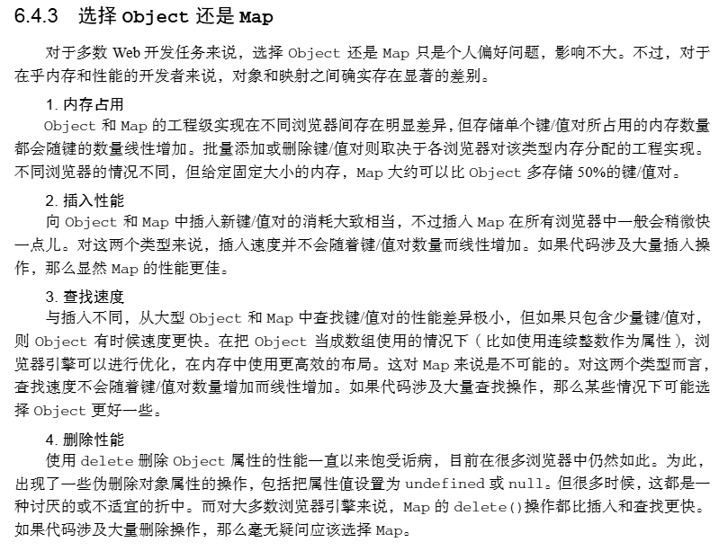
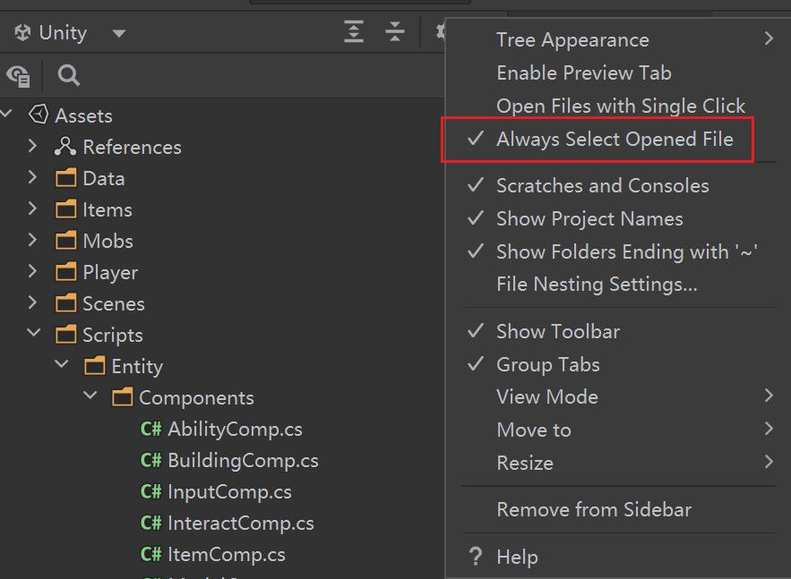

这是我以前所有的编程笔记的汇总。以前是分类优于日期，就是我开了很多个栏目，编程是其中的一个栏目，然后编程里面按日期记录笔记。但现在是日期优先，在每天的日志中记录所有发生的事情，不管类别。用标签和搜索管理这些笔记。

为什么我打算这么做，因为即便我按分类来记录了信息，可以看到编程笔记中仍然是不是会夹杂这与编程无关的内容，这一点其实是避免不了的。世间的事物哪有单一维度的划分机制。唯一真实存在的是如大江大河般滚滚而逝的时间。笔记只是让这些时间能有个纪念。

<!-- more -->

这里主要用来记录我生活中的所思所想，当然大部分可能是跟计算机、编程有关的。这些想法或者摘抄比较短小，不足以形成一篇文章，但仍然值得记录下来反复品味，回顾。它们的编排方式是按日期倒序来的。

# 2025-07-23

今天突然博客构建失败了，看了日志是因为有个 npm 包安装不了，链接：https://registry.npmjs.org/stylus/-/stylus-0.54.8.tgz，404。然后查了一下stylus，发现它已经从npm下架了：https://www.npmjs.com/package/stylus?activeTab=readme，原因是包含恶意代码被npm安全团队移除了。

然后我看了一下我博客的依赖，应该是`"hexo-renderer-stylus": "^0.3.1"`这个库依赖了 stylus，但我好像没用到这个，直接删了就行。

# 2025-07-02

[MCP 市场 - 收录 20,000+ MCP Servers 的全球最大平台](https://mcpmarket.cn/)

## react input 组件表情符号问题

发现一个奇怪的现象，react input 组件的 onChange 的 evt.target.value 里面可以有表情符号，但是 onBlur 的 evt.target.value 里面会过滤掉表情符号。

[react 的 input 组件，onChange 的 e.target.value 里包含了表情符号，但是 onBlur 的 e.target.value 里没有包含表情符号，这是为啥](https://yuanbao.tencent.com/bot/app/share/chat/F2GTivbitbKn)

## 编程概念 -- 事务

EDA 引入了比较粗暴的事务机制后，今天发现了一个问题：在连续放置器件的时候，修改上一个放置的器件的属性，然后取消当前放置器件操作，就会把修改属性也当作当前放置事务的一部分给回退了，但修改的属性其实不是当前待放置的器件的属性。

因为 EDA 经常出一些数据问题，就引入了这个事务机制，一次只能做一件事。

事务这个概念是为了解决原子性和一致性问题，比如金融领域，转账必须是一次扣款+一次入账，扣款没成功或者入账没成功都是不行的，需要回滚。但不是任何一个扣款和入账都被绑在一起，它们必须是同一个事务 ID。

# 2025-06-30

今天突然想怎么把一个 JavaScript number 类型的数字转进制，于是打开控制台敲下：`8.toString(2)`，我记得好像是这样写，但是报错了。不得不问一下 AI，没想到还真是这样写，但是要加圆括号：`(8).toString(2)`，可能是为了避免英文句号被当作小数点，从而引起语法上的冲突。

# 2025-06-26

今天翻看《JavaScript 高级程序设计第 4 版》突然发现了这个议题：**选择 Object 还是 Map**，这个问题我以前也想到过，不过没有深究



总的来说差别不大，我个人喜欢用 Object，因为感觉写起来更简单。

# 2025-06-25

昨天整理 chrome 书签的时候，看到一篇文章很感兴趣：[Ideas from "A Philosophy of Software Design"](https://www.16elt.com/2024/09/25/first-book-of-byte-sized-tech/index.html)，算是一本书的读书笔记，这本书也很不错：[A Philosophy of Software Design](https://book.douban.com/subject/30218046/)。

在豆瓣书评中看到这样一个例子：

删除正在使用的文件（Unix 的设计时好的设计），Windows 不能删除，并且会报错，现在可以删除文件了，但是删除正在使用的目录还是会报错；Unix 会把文件从文件系统直接删除，正在使用的进程还能继续使用（文件驻留在内存），当最后一个使用该文件的进程退出之后，文件就会在内存中消失真正被删除

以前就觉得 Windows 的这个设计非常的恶心，经常就是删文件和目录删不掉，提示正被占用，但是也不知道是哪个程序在占用，总是莫名其妙，遇到这种情况我一般是重启系统后再删，体验是非常的差。

# 2025-06-24

今天抽空解决了一下，博客搜索不能搜索栏目的问题(在 hexo 里面栏目叫做 page)。因为我开了比较多的栏目，如果不能在 search 里面统一搜索，还要点开每个栏目单独用浏览器的搜索功能，就会非常麻烦。这可能也是我以前想要放弃栏目的原因，但栏目又真的很好用，所以还是动手解决此问题了。

说起来挺简单的，打开 hexo 和主题的两个`_config.yml`文件，搜了一下 search，看看配置是否支持，顺藤摸瓜找到了这个：[hexo-generator-search](https://github.com/theme-next/hexo-generator-search)。这个项目的 readme 里面写的很清楚，修改`field: all`，就可以搜索所有 posts 和 pages 了。

# 2025-06-23

什么是 MCP，Model Context Protocal，模型上下文协议？

今天在小红书上看到一个讲 MCP 讲得很好的视频。总结就是 MCP 一种协议，用于 AI 调用资源和工具，比如 AI 访问网页就需要通过 MCP。有了 MCP 的好处就是方便复用，大家不必重复开发轮子。AI 刚出来那会儿我就在想这个问题，就是 AI 怎么使用原先的那些软件办事，比如让 AI 帮我打电话，做提醒，查信息等等。现在 Agentic AI 都已经在落地使用了，根本不是简单的聊个天了。

这个人很擅长经营履历的样子：https://www.guofei.site/

## 快捷编辑技巧

经常写代码或者写博客，有的时候会有一些快捷编辑的需要，比如：

- 向上或向下移动一行：alt + ↑/↓

### 🎯 ​​2. 高级多光标操作 ​​

1. 非连续行编辑：Alt + 鼠标点击 或 Ctrl + Alt + ↑/↓
2. 垂直添加光标 ​​：Ctrl + Alt + ↑/↓（Windows/Linux）或 Cmd + Option + ↑/↓（Mac），在选中行的上方或下方逐行添加光标。
3. 全行末尾添加光标 ​​：选中多行后按 Shift + Alt + I，在所有行的行尾插入光标。适用场景：在多行末尾统一添加分号、逗号等。

## 杏仁和巴旦木的区别

[杏仁和巴旦木的区别](https://www.sohu.com/a/470202440_120168933)

# 2025-01-03

修改 location.search，但不刷新可以做到吗？

1： `history.pushState`方法（HTML5），此方法可以产生一个历史记录，可以后退

```javascript
// 假设当前URL是https://example.com/page.html
let newSearchParams = "?param1=value1";
let newUrl = location.origin + location.pathname + newSearchParams;
history.pushState(null, "", newUrl);
console.log(location.search); // 输出:?param1=value1
```

2： `history.replaceState`方法（HTML5），此方法不产生历史记录

```javascript
let url = new URL(location.href);
url.search = "?newParam=newValue";
history.replaceState(null, "", url);
console.log(location.search); // 输出:?newParam=newValue
```

# 2024-12-27

vscode 上移下移一行代码快捷键：`alt+上下方向键`

# 2024-12-26

前端样式: resize: both

这个 resize 决定了 dom 元素是否可以拖拽大小。

官方文档: [resize - CSS: Cascading Style Sheets - MDN Web Docs - Mozilla](https://developer.mozilla.org/zh-CN/docs/Web/CSS/resize)

# 2024-12-13

js 的 attribute 和 property 的区别：

对于一个 input 元素，input.setAttribute('value', '111');是不能成功的，因为 input 没有 value 这个 attribute，只有 input.value 这个 property。

结论是，系统自带的一些特殊属性 attribute 和 property 是可以同步的，比如 input.title='111'和 input.setAttribute('title', '111')。自定义的属性就要小心修改了，因为不能同步，比如你 input.setAttribute('aaa', '111')，用 input.aaa 是获取不到的，input.bbb = '222'，用 input.getAttribute('bbb')也是获取不到的。还有就是要记忆一下哪些属性是可以同步的，比如上面的 value 就是个坑。

# 2024-12-10

clientWidth 获取的是整数，有一定误差，缩放的时候尤为明显，可能会导致一些布局排版的 bug，所以最好是用 getBoundingClientRect().width，它可以返回浮点数，就可以用来解决以上 bug

# 2024-10-21

什么情况下不会进 try finally 的 finally 部分？

今天遇到一个异步卡在 pending 的情况，导致不会进 finally。具体情况是，一个异步的弹框，没有写 onClose，要在 onClose 里面 resolve(false)

# 2024-10-16

最近遇到一个：

```css
text-overflow: ellipsis;
overflow: hidden;
white-space: nowrap;
```

失效的问题。最终查明原因是：`display: flex;`引起的

# 2024-10-10

今天遇到一个问题是，同一张图片资源，图片发生了更新。但如果 URL 不变的话，就不会去访问新的图片（除非刷新浏览器）。解决办法是给 URL 加时间戳。

```javascript
backgroundImage: `url(${content + "?" + Date.now()})`;
```

这个是不需要后端配合改什么东西的，后端只要无视这个时间戳参数即可

# 2024-09-23

从一到无穷大真的讲了蛮多这个世界的底层知识的。

原子摄影术这一小节讲到：
不要以为给原子拍照是件容易的事，因为在给这么小的物体照相时，**如果所用的照明光线的波长比被拍摄物体的尺寸大，照片就会模糊得一塌糊涂**。你总不能用刷墙的排笔来画工笔画吧！和微小的显微组织打过交道的生物学家都很明白这种困难，因为**细菌的大小（约 0.000 1 厘米）和可见光的波长相仿。如果要使细菌呈现出清晰的像，就得用紫外线给细菌摄影，才能获得较好的结果**。但是分子的尺寸及其在晶格中的间隔是如此之小（0.000 000 01 厘米），无论是可见光还是紫外线都无法充当画具。如果想要看到单个原子，非用波长比可见光短几千倍的射线——X 光——不可。但这么一来，又会遇到一个似乎无法克服的困难：**X 光可以穿透物体而不发生折射**，因此，无论是放大镜还是显微镜，都不会使 X 光聚焦。这种性质再加上 X 光的强大穿透力，在医学上当然是很有用的，**因为 X 光如果在穿透人体时发生折射，就会把 X 光底片弄成一片模糊。但就是这个性质，似乎又排除了得到任何一张放大的 X 光照片的可能性！**

# 2024-09-11

最近在玩两个游戏：factorio（异星工场）和 terraria（泰拉瑞亚）
在看的书：从一到无穷大

肝泰拉瑞亚有点肝不动了，我确实很喜欢游戏里的这种能力获得感，以及通过查游戏攻略来解决问题。长时间玩游戏眼睛吃不消了，打算开始研究真实世界。毕竟真实世界更加丰富而且神秘。

把 10 拆成两个数，两个数相乘等于 40，要怎么拆？

需要借助虚数，拆成：$$5+\sqrt{-15}$$和$$5-\sqrt{-15}$$

在《从一到无穷大》这本书写完后，许多世纪难题都被攻克了，它们有：

1. 哥德巴赫猜想
2. 费马大定理
3. 四色问题

# 2024-09-09

那天跟九源在路上讨论过，这个世界变得极强的方式，不是个人能力，而是人际关系网络。成为一个领袖或者教主，拥有一批粉丝，或者信徒。能够调动百万人的力量，才是强者。因为这个世界，一个人的力量终究是很有限的，它不像动漫，修仙或者武侠里描述的异世界，人可以以一敌百，以一敌百万。但它可以一领导一百万，以一指挥一百万。

所以在这个世界上，变强，的意思就是做一个教主或者精神领袖。

而达成这些，需要有个人魅力，塑造共识。

# 2024-09-06

今天同事遇到一个 position: relative 的元素，宽度设置了 16px，但一直显示是 0px，原因是 relative 在宽高不够的时候会被挤掉。可以用 position: absolute，这个不会被挤掉。

# 2024-09-03

今天同事问我关于`visibility: hidden`的父元素，子元素是`visibility: visible`，显示出了子元素的问题。以前面试的时候我写过一篇总结，但是找不到了。之后会补一篇。可以先参考一下这篇文章：[CSS 中用 opacity、visibility、display 属性将 元素隐藏 的 对比分析](https://segmentfault.com/a/1190000015116392)

## 多行文本显示末尾省略号

[多行文字 text-overflow: ellipsis 省略号失效问题](https://blog.csdn.net/qq_51978639/article/details/128862967)

```css
text-overflow: ellipsis;
overflow: hidden;
display: -webkit-box; //特别显示模式
-webkit-line-clamp: 8; //行数
-webkit-box-orient: vertical; //盒子中内容竖直排列
```

不用限定高度，因为已经限定了行数

# 2024-09-02

亿万富翁指的是身价在一亿美元以上的富豪。而不是身价在一万亿美元以上的富豪。万元户，百万富翁，千万富翁这些都是写实。亿万富翁是个虚数。理应叫亿富翁。

# 2024-08-30

今日阮一峰周报感兴趣的东西：

- [现代文转古文](https://modelscope.cn/studios/chostem/ancient_Chinese_text_generator)

# 2024-08-29

## position: fixed 一定基于视口吗

不一定，如果祖先的 transform 不为 none，就会基于祖先而非视口：[不受控制的 position:fixed](https://www.cnblogs.com/coco1s/p/7358830.html)

## git 合并冲突

今天在 git rebase 的过程中遇到一个问题，阻断了我的 rebase 解决冲突流程：

```
Git: 'pro-api/' does not have a commit checked out
```

最后查明原因是某个子目录多了一个`.git`文件夹，一个仓库是不可以有两个`.git`的。删掉这个多余的即可继续解决 rebase 的冲突。

[How to fix: error: '<filename>' does not have a commit checked out fatal: adding files failed when inputting "git add ." in command prompt](https://stackoverflow.com/questions/56873278/how-to-fix-error-filename-does-not-have-a-commit-checked-out-fatal-adding)

合并的时候，最好用 rebase，但该出问题的地方还是会出问题。比如我从`2.2.C`分支基础上新建一个`liuqin/updateCBB/2.2.C`分支，然后开发到一半，领导基于`2.2.C`分支开出了`2.2.D`分支，然后一些同事，在`2.2.D`分支和`liuqin/updateCBB/2.2.C`分支，修改了同一块代码，而且由于我的分支没有对应的构建发布（我自己在本地测），以至于修改出了问题，也没有人察觉（我们构建发布的分支，一旦构建报错，就会通知到内网聊天账号上，所以会第一时间得到解决）。最后合并的时候（从`liuqin/updateCBB/2.2.C`分支合并到`2.2.D`分支），一堆报错。

## 历史的变迁

- [让我们认真讨论一下“AI 霸权”时代人类的命运](https://www.woshipm.com/share/6106012.html)，这篇文章帮助我回顾了大量消失在历史中的职业，也让我更加清醒的认识到时代都在变化，更何况人呢，人怎么能一尘不变呢，你不变，时代就强迫你变。还有消失在历史中的物品：磁带，光盘，U 盘，MP3，有线耳机，收音机，广播台。

## 新旧事物对比

### 旧事物

- **传呼机（BP 机）**，曾经是重要的通讯工具，人们通过传呼机接收简短的信息，然后寻找固定电话回电。但随着手机的迅速发展，传呼机很快被淘汰，如今已几乎不见其踪影。我曾有幸在我舅舅家楼上翻出过一个 BP 机，可惜没搞懂怎么用。
- **软盘**，在早期计算机存储中发挥过重要作用，但存储容量小，且容易损坏。随着 U 盘、移动硬盘等存储设备的出现，软盘迅速退出历史舞台。软盘我是真没见过。
- **VCD 和 DVD 播放器，光盘**：在过去，人们通过 VCD 和 DVD 播放器观看电影、电视剧等视频内容，并且会购买或租赁相应的光盘。但现在，在线视频平台的普及让人们可以通过网络直接观看各种视频资源，无需使用光盘和播放器。VCD 和 DVD 播放器以及光盘逐渐被淘汰，相关的生产厂家也大量减少。小的时候借过一些光盘，看鬼片，动画片。
- **U 盘**：刚上大学的时候，还是人手一个 U 盘，后来就渐渐的不用了。
- **打字机**，曾经是办公室的必备设备，用于撰写文档和信件。随着电脑和打印机的普及，打字机的使用越来越少，现在更多地成为一种复古的收藏品。打字机我也是真没见过。
- **黑白电视机**，在彩色电视机出现之前，黑白电视机是人们了解世界的重要窗口。但随着科技的进步，彩色、高清、智能电视的普及，黑白电视机逐渐被淘汰。黑白电视机，没啥印象，好像没见过。
- **传统胶片相机和胶卷**，在数码摄影技术兴起前，胶片相机是记录影像的主要工具。但随着数码相机、手机拍照功能的不断强大，其便捷性、成像速度以及成本等优势，使得传统胶片相机和胶卷的使用越来越少。现在只有少数摄影爱好者或专业人士还会在特定领域使用胶片相机，以追求独特的复古质感和艺术效果。
- **固定电话**：曾经是家庭和办公场所的重要通讯工具。但随着移动电话的普及，人们可以随时随地进行通话，固定电话的重要性逐渐降低。现在很多家庭已不再安装固定电话，一些办公场所也减少了固定电话的数量，仅保留部分用于特定业务或应急联络。以前家里有过固定电话，我也用过。
- **公共电话亭**：曾经在街道、车站、商场等公共场所广泛分布，为人们提供紧急通讯或临时通讯的便利。但随着手机的普及，人们几乎可以随时随地进行通话，公共电话亭的使用需求急剧减少。许多公共电话亭遭到损坏或废弃，部分地区开始拆除或改造这些电话亭。
- **报纸和杂志**：过去是人们获取新闻、资讯和娱乐内容的主要渠道之一。然而，随着互联网的发展，人们越来越倾向于通过电子设备在线获取信息，新闻网站、电子杂志、社交媒体等提供了更及时、丰富且便捷的内容。报纸和杂志的发行量不断下降，许多传统的报刊媒体面临经营困难，部分甚至停止发行。小的时候最喜欢看杂志，比如：意林，读者，青年文摘，故事会，科幻世界。
- **闹钟（传统机械式）**：以前，传统的机械式闹钟是人们起床和安排时间的重要工具。而如今，智能手机具备了闹钟功能，且更加智能、方便，可以设置多个闹钟、选择不同的铃声，还能与日程安排等其他功能相结合。因此，传统机械式闹钟的使用场景大幅减少，市场需求也逐渐萎缩。机械式的闹钟我是真没用过，电子的用过。
- **现金**：随着电子支付的广泛应用，如移动支付（微信支付、支付宝等）、银行卡支付等，人们在日常生活中的现金使用频率越来越低。购物、餐饮、交通等许多场景都支持电子支付，人们只需携带手机或银行卡即可完成交易。现金交易不仅存在找零不便、容易丢失等问题，而且在支付效率上也低于电子支付。因此，现金在流通中的作用逐渐减弱，未来可能会进一步减少。现在出门都是手机支付，兜里根本没有一分钱了。
- **纸质地图**：在导航应用和电子地图出现之前，纸质地图是人们出行时必不可少的工具。但现在，智能手机上的各种导航软件提供了实时定位、路线规划、交通状况查询等功能，比纸质地图更加准确、便捷和实用。纸质地图的生产和销售数量大幅下降，仅在一些特定场合或作为收藏纪念品存在。以前家里必挂两张地图，一张世界地图，一张中国地图。
- **电梯操作员**
- **电话接线员**

### 新事物

- **共享单车，共享充电宝**：实际上是租赁，不是群众的物资，也配叫共享吗？从最开始的烧钱抢占市场，到最后的获得定价权后，疯狂提价。我现在都不用共享单车和充电宝，除非逼不得已，因为真的贵得离谱。
- **外卖**：外卖也是一样从最开始的烧钱抢占市场，到最后的获得定价权后，疯狂提价。
- **智能穿戴设备**：如智能手表、智能手环等。可以监测健康数据、接收通知、进行运动追踪等，为人们的生活带来极大的便利。它将科技与日常生活紧密结合，让人们更加关注自身健康和生活品质。我现在戴华为 watch4pro，主要用途：1. 看时间，2. 刷地铁，3. 支付，4. 看天气，5. 倒计时，6. 微信消息提醒
- **虚拟现实（VR）和增强现实（AR）技术**：为娱乐、教育、医疗等领域带来全新的体验。在游戏中，玩家可以沉浸在虚拟世界中；在教育领域，学生可以通过虚拟现实技术进行生动的学习；在医疗方面，医生可以利用增强现实技术进行手术辅助。玩过一些虚拟现实的游戏，就是戴个头盔，然后坐在一个摇摇车上，体验矿车上打僵尸。
- **人工智能助手**：像 Siri、小爱同学等，可以通过语音指令完成各种任务，如查询信息、播放音乐、设置提醒等。它们极大地提高了人们的生活效率，让人们与科技的交互更加自然和便捷。目前在用 chatgpt 和豆包。
- **新能源汽车**：随着环保意识的提高和技术的发展，新能源汽车逐渐成为主流。相比传统燃油汽车，新能源汽车更加环保、节能，并且在性能和智能化方面也不断提升。
- **直播和短视频平台**：为人们提供了展示自我、分享生活的新渠道。无论是普通人还是专业创作者，都可以通过直播和短视频平台获得关注和收益。同时，也为企业提供了新的营销方式。
- **自动驾驶**：百度旗下的萝卜快跑出租车正在全国铺开。其实自动驾驶的技术已经成熟，只是相应的法律法规没有成熟，最重要的一条是，如果是自动驾驶汽车出了车祸，负责任的应该是汽车厂商，但另一个问题随之而来，怎么证明出事的时候是车自己开的，而不是人开的。自动驾驶一旦普及，司机也会跟电梯操作员和电话接线员一样成为历史中消失的职业了。

# 2024-08-28

- [Open Source Intelligence Techniques](https://inteltechniques.com/book1.html)：全书都是在教你如何在网上搜索定位公开信息（严格来说，我觉得应该算半公开信息）。作者是一位受雇于美国政府的电脑犯罪调查员。

## 创业

关于资产我的看法很简单，找到那些开了很久的线下餐馆，如果是老板自己不来，雇了人打工的餐馆，找个合理的价格盘下来，那就是妥妥的资产，现金流。甚至都不用自己费劲的经营，直接原班人马继续搞就行。哪管上面老板是谁呢

也可以分析别人的经营不善的问题，盘下不良资产，盘活它。

但如果是自己创建一个，就需要发现市场的需求和空缺。

我的创业想法列表：

- 年轻人的商业秘籍。一个商业数据网站，收录当下所有常见商品的价格（包括原材料），收录各行各业的启动资金，创业成本（固定成本，按件成本），收益，回本周期，标记哪些是蓝海，哪些是红海（相对来说）。相当于给现实世界加上一个卖什么的攻略，玩过星露谷物语或者模拟城市我是市长这类经营类游戏的朋友都应该知道。选利润高的生意做非常重要。但是商业的本质就是信息差和资源差变现。感觉这类信息本身是不好收集的，因为我感觉他们很值钱。
- [作品版权证券化](https://liuqinh2s.github.io/blog/2024/08/03/%E4%BD%9C%E5%93%81%E7%89%88%E6%9D%83%E8%AF%81%E5%88%B8%E5%8C%96/)：简单来讲，目前的网易云音乐这类平台其实是信息类产品（音乐）的租赁平台。目前市场缺乏购买平台。作品版权证券化可以实现这个目标。
- 在塘朗山上看到有人卖矿泉水（无人值守的），全靠自觉，不清楚能不能赚钱，但总的来说国民素质在提高，比如黑神话悟空在以前一定会被盗版击垮，但现在却能大赚。说明国民的消费素质消费意识起来了。
- 在莲花山上的自动售卖机，客流量和销售量都还不错，不过不清楚成本，赚不赚钱存疑。
- 我有朋友在卖壮阳药，用短信销售和顺丰速递货到付款的方式。赚了蛮多钱的，这是一个赚钱的实例，可惜对方不愿意跟我分享。
- 另一个朋友在搞电商，短信销售+积分代金的形式。这也是一个赚钱的实例，都雇了一个小型团队了。而且搞了好几年的这个了。

# 2024-08-26

- [Putting the “You” in CPU](https://cpu.land/)，讲解 CPU 工作原理的
- [Fake Insects](https://huggingface.co/spaces/victor/fake-insects)，一个小游戏，两张照片中，判断哪张是 AI 生成的昆虫
- [Introduction to Bash Scripting](https://github.com/bobbyiliev/introduction-to-bash-scripting)，bash 脚本编程
- [Fighting Through Mental Struggles: Incredible Renderings Created with Only a Pencil](https://www.core77.com/posts/133324/Fighting-Through-Mental-Struggles-Incredible-Renderings-Created-with-Only-a-Pencil)，用铅笔画金属光泽

[Hugging Face](https://huggingface.co/)社区有点意思，AI 爱好者的社区
[core77](https://www.core77.com/)，工业设计爱好者网站

# 2024-08-18

我一直有看斗破苍穹和斗罗大陆的习惯，每周六都会收看。但是又不想充腾讯视频的会员，据说现在好像有会员也看不了最新一集，要付费才行，真是越来越狗了。刚刚去看了一下，是斗破苍穹年番必须要 SVIP 才能看，VIP 看不了最新一集。我一直觉得这种租赁的模式持续不了太多年了，平台也捞不到好，用户也捞不到好（那么谁捞到好？我觉得应该是那些烂作品捞到了好）。言归正传，今天我想分享的是如何免费看视频，我通常是这几个地方：

1. 抖音，某些个人账号分享的，一不是很清晰，二甚至是对着手机拍的，画面很小。另外就是时效性，会在比较短的时间内下架（为了避免吃官司）
2. [努努视频](https://nnyy.in/)，许多链路会失效，然后速度不是很快，很容易卡，卡得人没心情看了都。优点是所有视频免费
3. [艾旦视频](https://www.lovedan.net/)，部分内容是要付费的（貌似小黄片才需要付费），但视频资源极其丰富。缺点也是在线看有点卡，但支持下载，下载看体验不错。
4. [量子资源网](http://lzizy.net)，内容也是相当丰富，而且播放非常流畅，强烈推荐。
5. 囧次元 app，看动漫专用，可以看蓝光质量的视频，缺点是有广告。
6. 电报极搜搜索引擎，海量资源

但我今天发现 IINA 居然可以直接用打开 URL 的方式看艾旦视频的下载链接，真的是非常不错的体验。（原因找到了，艾旦视频和量子资源的斗破苍穹 108 集都是同一个链接，是一个 mp4 资源，所以才可以直接用 IINA 打开）

> [IINA](https://iina.io/)是 mac os 上独有的视频播放器，非常棒的播放器

# 2024-08-13

## chrome 离线下载

工欲善其事必先利其器，最近公司项目开发上，chrome 浏览器（版本：127.0.6533.100）的 devtool 经常性卡死，真的把我的耐心磨没了，真的是越做越烂了。打算装回旧版本的 chrome。那么如何安装旧版本的 chrome 呢，找离线安装包也挺费劲的：

- [Chromium 历史版本离线安装包 - 下载方法](https://github.com/vikyd/note/blob/master/chrome_offline_download.md)

## 前端打包工具一览

- [webpack](https://webpack.js.org/)
- [esbuild](https://esbuild.github.io/)
- [rollup](https://www.rollupjs.com/)
- [farm](https://farm-fe.github.io/)
- [rolldown](https://github.com/rolldown/rolldown)
- [rspack](https://rspack.dev/)

# 2024-08-07

公司的前端项目，经常需要用到表格，而且需要相当丰富的功能。但我们之前做的表格实在是拉跨，代码量大，API 设计一般，还有许多业务层的代码渗透进了组件代码，功能也不是十分完善（比如单元格合并就没有）。

于是我想要先调研一下市面上的 react 表格组件，看能否找到一个特别好用的

- [最好的 6 个 React Table 组件详细亲测推荐](https://segmentfault.com/a/1190000041585593)：作者最推荐 [React Table](https://tanstack.com/table/v7)

# 2024-08-06

## font awesome

本地的 node 版本不适配 hexo 版本，所以不能在本地调试博客，但需要快速确认哪些 font awesome icon 能用。一个简单的办法是查看 network，找到 font-awesome 的版本。我看了一下是 4.6.2，上网搜了一下这个版本的所有可用图标：https://fontawesome.com/v4/icons/

## 文件夹命名规范

改了一下博客文件夹的首字母大小写，然后发现 git 并不能把这种变化推送到云端。

## 有条件的数组

开发过程中经常遇到一些有条件的数组元素，一般我是用一个空数组起头，然后罗列各种条件下 push 什么：

```typescript
let arr = [];
if (xxx) {
  arr.push(balabala1);
}
if (xxx1) {
  arr.push(balabala2);
}
```

总感觉写法不是很优雅。

原因是没有很好的体现出数组的顺序性。下面换一种写法：

```typescript
[
  xxx && balabala1,
  (function () {
    /** do a lot of things */
  })() && balabala2,
].filter(Boolean);
```

当然这种写法是针对元素顺序固定，但元素不一定有的情况。如果元素顺序不固定，那这种写法就不够灵活

## substring

js 如何截取子字符串，用`substring(startIndex, endIndex)`：https://developer.mozilla.org/zh-CN/docs/Web/JavaScript/Reference/Global_Objects/String/substring 。在控制台输入的时候，还有一个 api：`substr(startIndex, subStrLength)`，这个 api 已经废弃了：https://developer.mozilla.org/zh-CN/docs/Web/JavaScript/Reference/Global_Objects/String/substr

大概是因为前者更符合使用者的直觉吧。

[substring，substr，slice 三者的区别](https://developer.mozilla.org/zh-CN/docs/Web/JavaScript/Reference/Global_Objects/String/substring#substring_%E5%92%8C_substr_%E4%B9%8B%E9%97%B4%E7%9A%84%E5%8C%BA%E5%88%AB)

## [setProperty](https://developer.mozilla.org/en-US/docs/Web/API/CSSStyleDeclaration/setProperty)

这个 api 的用处在于，可以给 css 设置`!important`。否则就跟 style.height 一样。

```typescript
style.setProperty("height", "calc(100% - 24px)", "!important");
```

以下两个效果是一样的：

```typescript
style.setProperty("height", "calc(100% - 24px)");
style.height = "calc(100% - 24px)";
```

# 2024-08-05

最近推送博客到 github 老是出问题：`git connection reset by 20.205.243.160 port 443`，于是查了一下：

https://www.v2ex.com/t/841032

## eslint

同事建议的 eslint 规则：https://github.com/zengxiaoluan/eslint-plugin-jlc

## window.open

公司项目有个需求是有个属性叫：数据手册，然后点击后要跳转到用户指定的链接，但这个链接可能是本地链接。如果是在客户端环境，就能绕过浏览器的安全策略，打开本地链接，如果是浏览器环境，就要阻止打开。但很可惜的是，在某些版本的 chrome 浏览器上，会自动拼接当前域名。比如本地链接是：`C:\Users\win10\Pictures\1.png`，当前域名是：`www.baidu.com`，就会打开链接：`https://www.baidu.com/C:\Users\win10\Pictures\1.png`。比较棘手

# 2024-08-01

github 总是抽风，push 不上去，实在受不了了，又来搞代理了，记不住命令，每次都要上网查实在不方便，还是记录到自己博客上吧

## git 查看、设置、取消代理

查看代理：

```bash
git config --global --get http.proxy
git config --global --get https.proxy
```

设置代理：

```bash
git config --global http.proxy http://127.0.0.1:1080
git config --global https.proxy http://127.0.0.1:1080
```

取消代理：

```bash
git config --global --unset http.proxy
git config --global --unset https.proxy
```

## 观察者细粒度 onChange 的解决方案

1. 如果只涉及到显示问题，则用 debounce 解决即可
2. 如果涉及到数据，则必须要求时序正确性，必须用事务+粗粒度 onChange

## side project

什么样的 side project 是好的，首先要 **工作量小**，虽然一般来说工作量小意味着没有护城河，但没关系，可以用 **质量精或者小众蓝海** 来解决。工作量大一定是不行的，因为本来就不是主职，根本没有那么多时间精力去做。谁打完一天工，还想搞东搞西啊。

# 2024-07-31

加了 disabled 的 input，点击的时候是不会接受 onClick 事件的：https://developer.mozilla.org/zh-CN/docs/Web/HTML/Attributes/disabled

- [事件](https://developer.mozilla.org/zh-CN/docs/Learn/JavaScript/Building_blocks/Events)
- [事件冒泡](https://developer.mozilla.org/zh-CN/docs/Learn/JavaScript/Building_blocks/Event_bubbling)
- [event.stopPropagation](https://developer.mozilla.org/zh-CN/docs/Web/API/Event/stopPropagation)

## 编程思考

做新需求主要看两个方面：

1. 对原先代码的破坏程度
2. 代码量大不大

如果能整出一套，对这两点都好的设计，就舒服了

新加需求代码位置的问题：

1. 不放底层实现不了的，就放底层。否则尽量不放底层
2. 基础的东西，放底层，不变的东西放底层
3. 底层尽量稳定，不改。尽量不往底层加东西
4. 业务层可以膨胀，但是底层不可以
5. 底层的范围：除业务层外的所有层都算底层

一般是三层设计：MVC（Model View Controllor），即：数据层，视图层，控制层（业务层）

只有业务层是可以膨胀的，数据层和视图层基本稳定不变。

回过头来看，对原先代码的破坏程度低，其实用 **分层** 就可以实现。代码量大不大，则依赖 **自动挡** 来解决（手动挡对应原子化，自动挡对应封装良好的 API+观察者+事务）

原子化是基础，组合原子化的 API 形成丰富的组合功能是下一步。

# 2024-07-30

## 文本超长省略号

把文本改成链接，还要实现`text-overflow:ellipsis`效果，要怎么搞？

## typescript 函数重载。

在开发的时候，经常遇到这样一种情况，如果数据是多层级的对象，想用一个函数来实现多种策略下获取不同层级的数据，但是呢又不想在调用的时候强制转换类型（因为不同层级的数据类型是不一样的），这个时候，就可以用到函数重载：

```typescript
get(): BatchInstanceAttr;
get(tabId: string): InstanceAttr;
get(tabId: string, eid: string): AttrIdData;
get(tabId: string, eid: string, propertyKey: string): string;
get(tabId?: string, eid?: string, propertyKey?: string): BatchInstanceAttr | InstanceAttr | AttrIdData | string {
  // 具体实现
};
```

因为不管你使用哪一种参数，都有具体的返回类型对应，所以调用方就不用手动注明类型了。

# 2024-07-29

很久没有做记录，并非是没有东西要写，而是之前服务器和域名过期，导致 github pages 访问不了，一时半会儿我没弄好，然后就去 wolai 上面记录了。结果发现 wolai （要付费才能分享笔记）和 notion（要观看方先注册 notion 才能看） 居然没法很好的分享笔记了。大为恼火。还是回到用 githubs pages 记录这种古老的方法来。之前探讨过：由于博客没人看，而且不方便记录，所以，实际上用博客记录+分享是一种不好的方式，缺点是既不好记录，也不好分享，优点是结合了记录和分享，all in one，一站式服务。算是一种折中吧。最好的方式仍然是用一个好的笔记工具记录，然后再弄到流量很大的网站（小红书，抖音，知乎，微博，B 站等等）。但现在居然连一个很好的笔记工具都没有了。之后我会考虑自己做一个，要做的东西其实蛮多的：

1. 笔记软件，最好是加入绘图工具
2. UGC 分享平台，但数据要属于用户，用户的数据神圣不可侵犯。内容不是平台的，把内容的所有权还给用户
3. 作品版权证券化
4. all in one

## 事件监听

公司项目中遇到一个问题是，用户正在编辑中文，然后按 esc 退出了一个 iframe 内的 textarea，查看代码后发现 window.top 对 textarea 是有一套 compositionstart 的监听的，但 iframe 里面没有监听。

document 上加监听是监听不到其内 iframe 内的元素的。如果要监听 iframe 内的元素的事件，则必须要再对 iframe 的 document 再做监听。

## 国内 github 月经问题

刚刚 github 又出问题，提示 Git: connection reset by xxxip xxxport。解决办法：`git config --global --unset-all remote.origin.proxy`

本机 ping 了一下 github，发现提示上的 ip 和 ping 出来的 ip 不一样。

> https://stackoverflow.com/questions/71571965/openssl-ssl-connect-connection-was-reset-in-connection-to-github-com443-while

## 编程的设计模式

1. 简单的业务用命令式编程
2. 复杂的用 react，只关注数据，不关心 DOM 操作。即：声明式编程
3. 更复杂的用观察者，只关注数据，不关心其他模块的更新。
4. 更更复杂的，连数据更新都复杂，上事务，管理好数据更新。

但是用复杂的设计模式也带来相应的问题。

比如观察者遇到一个问题，就是数据变化 onChange 粒度太细，会造成很多不必要的显示更新。解决办法有这样几种：

1. 防抖
2. 粗粒度的 onChange

防抖比较简单，就不讲了。实现粗粒度，也就是一组操作一个 onChange。实际上把这组操作放入事务，事务结束后发出 onChange，就能达到目的。

# 2024-05-20

最近在看怎样写好 react：

- [我在工作中写 React，学到了什么？性能优化篇](https://juejin.cn/post/6889247428797530126)
- [如何写出优秀的 React 代码](https://pengtikui.cn/blog/how-to-write-great-react)
- [代码重构之路：编写干净的 React Components & JSX](https://zhuanlan.zhihu.com/p/161886512)
- [如何写出优雅的 react 组件？](https://juejin.cn/post/7012260002895233055)
- [React 最佳实践--如何写出更好的 React 代码（2022 年版）](https://www.freecodecamp.org/chinese/news/best-practices-for-react/)

# 2024-05-17

最近实现 react Table 组件遇到不少问题，所以打算多学点 react，这篇文章讲`useReducer`，讲得很好:

[这一次彻底搞定 useReducer-使用篇](https://juejin.cn/post/6844903869604986888)

# 2024-04-17

hmr invalidate

https://www.lcs.show/blog/common/vite-hmr

# 2024-04-09

react 组件在写成函数的时候，是会引起父组件渲染的：

App.tsx

```typescript
import "./App.css";
import { Child } from "./Child";

export default function App() {
  alert("父组件渲染");
  return (
    <main>
      React ⚛️ + Vite ⚡ + Replit 🌀
      {Child()}
    </main>
  );
}
```

Child.tsx

```typescript
import { useState } from "react";

export const Child = () => {
  const [a, setA] = useState(0);
  return (
    <div
      onClick={() => {
        setA(a + 1);
      }}
    >
      {a}
    </div>
  );
};
```

改为组件式写法，才能避免父组件被渲染：

```typescript
import "./App.css";
import { Child } from "./Child";

export default function App() {
  alert("父组件渲染");
  return (
    <main>
      React ⚛️ + Vite ⚡ + Replit 🌀
      <Child></Child>
    </main>
  );
}
```

至于原因，还不了解。

参考：

https://www.zhihu.com/question/448269343

# 2024-03-24

怎么简化大量的 if else 结构，可以用 map 来实现：

```javascript
class A {}

class B {}

function a() {}

function b() {}

function f1(x) {
  if (x instanceof A) {
    a();
  } else if (x instanceof B) {
    b();
  }
}

const h = [
  { cb: a, match: (x) => x instanceof A },
  { cb: b, match: (x) => x instanceof B },
];

function f2(x) {
  h.find((y) => y.match(x))?.cb();
}
```

# 2024-03-23

## eslint 配置

在文件头部写如下注释，即可让 eslint 某部分检查跳过此文件：

```
/* eslint no-console: "off" */
/* eslint no-fallthrough: "off" */
```

参考：https://uovol.com/unexpected-console-statement--no-console

这样的设计真是蛮好用的

## scrollWidth, offsetWidth, clientWidth 的区别

- scrollWidth 是元素真实的宽度（但不包含 border 和滚动条，但包含 padding）
- offsetWidth 也是真实的元素宽度（但包含 border 和滚动条）
- clientWidth 是元素的可视宽度（不包含 border 和滚动条）

scrollHeight，offsetHeight，clientHeight 同理

可以用如下例子测试：

```html
<!DOCTYPE html>
<html lang="en">
  <head>
    <meta charset="UTF-8" />
    <meta name="viewport" content="width=device-width, initial-scale=1.0" />
    <meta http-equiv="X-UA-Compatible" content="ie=edge" />
    <title>Document</title>
    <style>
      div {
        border: 1px solid #000;
        width: 100px;
        height: 200px;
        padding-right: 15px;
        padding-bottom: 15px;
        background-color: aquamarine;
        margin-left: 10px;
        overflow: hidden;
        overflow-x: scroll;
      }
    </style>
  </head>
  <body>
    <div>sdsssssssssssssssssssssssssssdssssssssssssssssssssssssss</div>
    <script>
      console.log(
        "scrollWidth: ",
        document.querySelectorAll("div")[0].scrollWidth
      );
      console.log(
        "clientWidth: ",
        document.querySelectorAll("div")[0].clientWidth
      );
      console.log(
        "offsetWidth: ",
        document.querySelectorAll("div")[0].offsetWidth
      );
      console.log(
        "scrollHeight: ",
        document.querySelectorAll("div")[0].scrollHeight
      );
      console.log(
        "clientHeight: ",
        document.querySelectorAll("div")[0].clientHeight
      );
      console.log(
        "offsetHeight: ",
        document.querySelectorAll("div")[0].offsetHeight
      );
    </script>
  </body>
</html>
```

## useCallback 的实践例子

https://replit.com/@liuqinh2s/useCallback#README.md

# 2024-03-09

react 开发过程中，经常遇到一些奇怪的问题。最近解决的这个尤为奇怪，报错：`rendered fewer hooks than expected. this may be caused by an accidental early return statement`。但我并没有把 hooks 写道条件语句里面。最终从这篇文章找到了我想要的答案：[https://medium.com/@jonchurch/how-to-fix-react-error-rendered-fewer-hooks-than-expected-e6a378985d3c](https://medium.com/@jonchurch/how-to-fix-react-error-rendered-fewer-hooks-than-expected-e6a378985d3c)

原因是我用普通函数调用的写法，应该改为组件写法：

错误写法：

```typescript
export const Component1 = () => {
  function getHtml() {
    return <div></div>;
  }

  return <div>{getHtml()}</div>;
};
```

正确写法：

```typescript
export const Component1 = () => {
  function GetHtml() {
    return <div></div>;
  }

  return (
    <div>
      <GetHtml></GetHtml>
    </div>
  );
};
```

> 注意 React 组件首字母要大写

# 2024-02-18

如何实现毛玻璃效果，css:

```css
filter: blur(5px);
```

# 2023-01-30

最近实现了一个拖拽条组件，发现拖拽的时候会选中一些文本，从而导致下一次拖拽时 pointerup 监听不到。解决办法是：拖拽的时候设置样式`user-select: none;`到 document.body 上，禁止选中，从而解决问题。

# 2023-12-08

在网上看到写的很好的人工智能入门文章：[Neural Networks From Scratch](https://victorzhou.com/series/neural-networks-from-scratch/)

# 2023-11-28

如何让超出的文字显示：`...`

```css
overflow: hidden;
white-space: nowrap;
text-overflow: ellipsis;
```

# 2023-11-22

今日话题：

- react 组件如何正确的卸载
- 浏览器如何加载本地所有字体

新的 api，`await window.queryLocalFonts()`可以加载本地所有字体。参看文档：[window: queryLocalFonts() method - Web APIs | MDN](https://developer.mozilla.org/en-US/docs/Web/API/Window/queryLocalFonts)

# 2023-11-21

今日话题：

- requestAnimationFrame
- 大量循环重复获取某个值时，如何加速？

[Window: requestAnimationFrame() method - Web APIs | MDN](https://developer.mozilla.org/en-US/docs/Web/API/window/requestAnimationFrame)

`requestAnimationFrame(callbackFn)`让浏览器在下次重绘之前调用你的 callback 函数，这个方法是一次性的，如果你想持续用，就要持续调用。

在实际的开发环节，大量循环重复获取某个值时，如何加速？这时候就需要做缓存，但这个缓存不可以太久，否则可能会面临不够新的问题：

```typescript
function costManyTime() {
  let count = 0;
  for (let i = 0; i < 100_0000; i++) {
    count += Math.random();
  }
  return count;
}

function getValue(key) {
  const value = costManyTime();
  return value;
}

const cache = new Map();
function getValue2(key) {
  setTimeout(() => {
    if (cache.size > 0) {
      cache.clear();
    }
  }, 500);
  if (cache.has(key)) {
    return cache.get(key);
  }
  const value = costManyTime();
  cache.set(key, value);
  return value;
}

console.time("costManyTime");
costManyTime();
console.timeEnd("costManyTime");

console.time("loop getValue");
let hh = [];
for (let i = 0; i < 1000; i++) {
  hh.push(getValue("key"));
}
console.timeEnd("loop getValue");
hh.length = 0;
console.time("loop getValue2");
for (let i = 0; i < 1000; i++) {
  hh.push(getValue2("key"));
}
console.timeEnd("loop getValue2");
```

以上代码，缓存存在 500ms，依旧存在如下两个问题：

1. 如果值在这 500ms 内更新了，那么就会遇到没获取到最新值的问题
2. 如果`loop getValue`整体时长超过了 500ms，那么缓存会失效并进行重建

# 2023-11-14

今日需求

1. 山城导航

在重庆的时候，发现地图导航完全是错的，不管是步行导航，还是驾驶导航。然后司机说要用本地的离线地图包，我当时在想离线地图包还有此等神奇的作用吗？像重庆这种山城，高度定位似乎很不准，在不同的海拔高度，路线根本不一样。要怎么解决这种问题呢

I had a dream that I speak English in any situation all the night.

我昨晚梦到自己在梦里一直讲英语，就是任何场景下都在用英语输出。真是个怪现象

但确实可以做到其实，现在有了 chatgpt 就相当于有了一个随身的英语老师，它甚至可以帮我零成本的同声传译。

# 2023-11-13

今日发现的 bug：

1. 在用 label for 的时候发现 id 重复，导致无法点击触发 checkbox 勾选
2. http post 参数传错导致 404

朋友提出，可以用[useId](https://zh-hans.react.dev/reference/react/useId)来避免 id 重复

今日发现的需求：

1. 二维表格：画一个笛卡尔积（二位表格）的时候发现，二维表格用 markdown 很不好画，想要在一个单元格里面画一根斜线更是难（画斜线其实可以直接敲个字符`\`，毕竟是给人看的，人能懂就行）。于是我用 eda 画了一个二位表格
2. 查找项目中的一个文件的某个函数中的历史代码（想看演变过程），发现没有很好的工具，只能看到文件的提交历史。能否自己做一个出来

## window location href 和 hash（#）

1. 修改了 hash 不会刷新，修改了非 hash 会刷新
2. 有`#`的情况下，自己等于自己不会刷新，**没带`#`的情况下，自己等于自己会刷新**
3. 去掉`#`会刷新
4. 加上`#`不会刷新

# 2023-10-23

## ts 项目使用 js 包

ts 项目引入 js 包会报错，我们只需要在项目的任意位置新建一个`xxx.d.ts`文件，内容填入：

```javascript
declare module '【import 的第三方库名】';
```

即可解决报错

> TODO: 发布一个 typescript 的 npm 包

## nginx 同一端口不同路径映射到不同项目

```
location /project1 {
  alias /xxx/project1
  index index.html
}

location /project2 {
  alias /xxx/project2
  index index.html
}
```

# 2023-10-20

发现一个问题 Object.defineProperty 一旦设置了 set 方法，就没办法设置值到该属性上了，只能通过 get 的时候返回对应值来达到不影响原来代码的目的。比如：

```javascript
var a = { a: 1 };
Object.defineProperty(a, "a", {
  set(x) {
    console.log(x);
    this.b = x;
  },
  get() {
    return this.b;
  },
});
a.a = 8;
console.log(a);
console.log(a.a);
```

尝试在 set 里面写`this.a = x;`会导致死循环，而写`return x;`则依旧没有设置上 a.a

# 2023-10-18

## 如何发布自己的 npm 包？

1. 到`https://www.npmjs.com/`注册账号
2. `npm init -y`新建一个项目
3. 在控制台`npm login`登录自己账号
4. 到项目目录下`npm publish --access public`，发布公开包（私有包要收费）

> 注意事项，新建项目的目录不能是中文会报错，如果没充钱`--access public`是必须的，包名可能会跟已有的包名冲突，可以通过`npm search xxx`查询

## npm 依赖包版本号

[npm 语义版本(npm 依赖包版本的~、>、^符号各代表什么？)](https://blog.51cto.com/u_15127697/3633383)

# 2023-10-17

SVG 默认开了抗锯齿，会把 1 像素的线条用 2 像素显示

SVG 如果想展示真实的像素（关闭抗锯齿），可以设置 css：`shape-rendering: crispEdges`

但 HTML5 canvas 不能这样达到目的

[graphics - SVG / Canvas :: shape-rendering="crispEdges" via JavaScript? - Stack Overflow](https://stackoverflow.com/questions/11353499/svg-canvas-shape-rendering-crispedges-via-javascript)

canvas 可以通过以下方法来达到目的：

```
当线宽为偶数时，坐标应指定为整数。否则坐标应指定为整数+0.5px。
```

[canvas 图像重叠处理 - Kaiqisan](https://blog.csdn.net/qq_33933205/article/details/107337882)

# 2023-10-16

在 disabled 的 input 上面，右键，父级 div 的 onMouseDown 进不了，要怎么办？可以在事件的捕获阶段监听：

```javascript
elem.addEventListener(..., {capture: true})
// 或者，用 {capture: true} 的别名 "true"
elem.addEventListener(..., true)
```

DOM 事件标准描述了事件传播的 3 个阶段：

捕获阶段（Capturing phase）—— 事件（从 Window）向下走近元素。
目标阶段（Target phase）—— 事件到达目标元素。
冒泡阶段（Bubbling phase）—— 事件从元素上开始冒泡。

如果是 react 的话，就用 onMouseDownCapture。

不过最后发现依然不行，要用 onPointerDownCapture 才可以。

# 2023-08-11

[Systems, math and explosions (in no particular order)](https://pjonori.blog/posts/systems-math-explosions/)

这篇文章讲系统是怎么变复杂的（因连接而复杂），以及怎么消除复杂和混乱（减少节点）。

[PJ Onori’s blog](https://pjonori.blog/)

# 2023-08-10

[JavaScript 模块的循环加载](https://www.ruanyifeng.com/blog/2015/11/circular-dependency.html)

# 2023-08-07

## html 空格自动合并的问题

HTML 提供了 5 种空格实体（space entity），它们拥有不同的宽度，非断行空格( )是常规空格的宽度，可运行于所有主流浏览器。其他几种空格( `&ensp;&emsp;&thinsp;&zwnj;&zwj;`）在不同浏览器中宽度各异。

`&nbsp;`它叫不换行空格，全称 No-Break Space，它是最常见和我们使用最多的空格，按下 space 键产生的空格。在 HTML 中，如果你用空格键产生此空格，空格是不会累加的（只算 1 个）。要使用 html 实体表示才可累加，该空格占据宽度受字体影响明显而强烈。

`&ensp;`它叫"半角空格"，全称是 En Space，en 是字体排印学的计量单位，为 em 宽度的一半。根据定义，它等同于字体度的一半（如 16px 字体中就是 8px）。名义上是小写字母 n 的宽度。此空格传承空格家族一贯的特性：透明的，其占据的宽度正好是 1/2 个中文宽度，而且基本上不受字体影响。

`&emsp;`它叫“全角空格”，全称是 Em Space，em 是字体排印学的计量单位，相当于当前指定的点数。例如，1 em 在 16px 的字体中就是 16px。此空格也传承空格家族一贯的特性：透明的，其占据的宽度正好是 1 个中文宽度，而且基本上不受字体影响。

`&thinsp;`它叫窄空格，全称是 Thin Space。我们不妨称之为"瘦弱空格";，就是该空格占据的宽度比较小。它是 em 之六分之一宽。

`&zwnj;`它叫零宽不连字，全称是 Zero Width Non Joiner，简称"ZWNJ"，是一个不打印字符，放在电子文本的两个字符之间，抑制本来会发生的连字，改为以这两个字符原本的字形来绘制。Unicode 中的零宽不连字字符映射为`&ldquo;&rdquo`;（zero width non-joiner，U+200C），HTML 字符值引用为:`&zwnj`;

`&zwj;`它叫零宽连字，全称是 Zero Width Joiner，简称“ZWJ”，是一个不打印字符，放在某些需要复杂排版语言（如阿拉伯语、印地语）的两个字符之间，使得这两个本不会发生连字的字符产生了连字效果。零宽连字符的 Unicode 码位是 U+200D(HTML: ‍ `&zwj;`）。

此外，浏览器还会把以下字符当作空白进行解析：空格（`&#x0020;`）、制表位（`&#x0009;`）、换行（`&#x000A;`）和回车（ `&#x000D;`）还有中文全角空格（`&#12288;`）等等。

> 用`tspan`标签和`xml:space="preserve"`也可以解决

# 2023-08-02

最近想把某个消息放在组件文件中进行监听，但发现消息总线可能还没注册好，这个时候可以用`DOMContentLoaded`这个事件。

官方文档：[Window: DOMContentLoaded event](https://developer.mozilla.org/en-US/docs/Web/API/Window/DOMContentLoaded_event)

1. 默认情况下，脚本只阻塞其后的 dom 元素解析
2. defer 告诉浏览器，脚本需要等 HTML 解析完后执行（多个 defer 脚本按出现顺序执行）
3. async 告诉浏览器，脚本异步下载（与 HTML 解析一起进行），下载完后会立即执行（不会等 HTML 解析完）

所以一般来说，如果脚本与 HTML 有关，就用 defer，无关就用 async

# 2023-07-26

## localeCompare

js 自然排序：[localeCompare](https://developer.mozilla.org/en-US/docs/Web/JavaScript/Reference/Global_Objects/String/localeCompare)

[用 localeCompare 实现字符串自然排序](https://idealark.cn/archives/12/)

```typescript
arr.sort((a, b) => b.localeCompare(a));
```

## 对象遍历的速度比较

`Object.keys()`，`Object.values()`，`Object.entries()`的性能差异如何呢？

```JavaScript
let res = {};
for(let i=0;i<100_0000;i++){
    res[i]=i;
}
let count=0;
// console.time('Object.keys()')
// for(let k of Object.keys(res||{})){
//     count++;
// }
// console.timeEnd('Object.keys()')

// count=0;
// console.time('Object.values()')
// for(let v of Object.values(res||{})){
//     count++;
// }
// console.timeEnd('Object.values()')

count=0;
console.time('Object.entries()')
for(let [k,v] of Object.entries(res||{})){
    count++;
}
console.timeEnd('Object.entries()')
```

测试结果是 values()速度最快，values()速度>keys()速度>entries()速度

values()大概只有 keys()执行时间的十分之一，而 keys 执行时间大概是 entries 的一半

而写法上把`Object.keys`写在 for 里面和 for 外面其实是一样的速度：

```javascript
for(let v of Object.keys(res||{}))

const values = Object.keys(res||{});
for(let v of values)
```

for 循环只会在初始化的时候计算一次`Object.keys`，以下代码可以验证：

```javascript
const a = {};
for (let i = 0; i < 10; i++) {
  a[i] = i;
}
for (let k of Object.keys(a || {})) {
  a[k + "a"] = k + "a";
  console.log("1");
}
console.log(a);
```

`1`只会打印 10 次

以下写法类似：

```javascript
const a = {};
for (let i = 0; i < 100_0000; i++) {
  a[i] = i;
}
let count = 0;
console.time("a");
for (let k of Object.keys(a || {})) {
  a[k] = k + "a";
}
console.timeEnd("a");
count = 0;
console.time("b");
for (let i = 0, keys = Object.keys(a || {}); i < keys.length; i++) {
  a[keys[i]] = keys[i] + "a";
}
console.timeEnd("b");
```

## `for of` 和 `for in`

`for of`用于遍历可迭代对象（数组之类的），`for in`用于遍历对象

`for in`速度跟`for of`+`Object.keys()`差不多，区别是 in 会遍历到 prototype 上的属性，而后者则不会。所以如果不想遍历到原型上的属性，要么别用`for in`，要么要多写一个 obj.hasOwnProperty 的判断

```javascript
class A {
  a = "a";
}

class B extends A {
  b = "b";
}

let bb = new B();
bb.__proto__.c = "c";
for (let k in bb) {
  if (bb.hasOwnProperty(k)) {
    console.log(k);
  }
  // console.log(k)
}

for (let k of Object.keys(bb || {})) {
  console.log(k);
}
```

官方文档：

- [for of](https://developer.mozilla.org/zh-CN/docs/Web/JavaScript/Reference/Statements/for...of)
- [for in](https://developer.mozilla.org/en-US/docs/Web/JavaScript/Reference/Statements/for...in)

## `for of`和 C 语言语法的遍历速度比较

```javascript
let res = new Array(100_0000);
let count = 0;
console.time("a");
for (let i = 0; i < res.length; i++) {
  count++;
}
console.timeEnd("a");
count = 0;
console.time("b");
for (let i of res) {
  count++;
}
console.timeEnd("b");
```

大概有 6 倍的差距

# 2023-07-19

消息总线和函数调用的区别：消息总线用了一个集合来收集事件回调函数，导致了消息总线可以在外部零散的注册回调，而函数调用则相当于是在消息发出的地方集中注册消息监听。**所以消息总线很好的对依赖进行了倒置，因为，是事件回调函数依赖了事件，而不是事件依赖了事件的响应函数**。

> 所以从本质上来说，就是 A 依赖 B，还是 B 依赖 A 的问题。你有一段逻辑 A 和一段逻辑 B，其中 B 要在 A 之后执行，如果你认为应该是 A 依赖了 B，那么直接调用即可，如果你认为是 B 依赖了 A，那么就用消息总线。

用浏览器的 window.postMessage 或者 worker.postMessage，可以把消息发到其他的 window 或者 worker 来执行事件回调函数。但这样的话就是异步执行了。

```javascript
window1.postMessage("hello", "*");
window2.addEventListener("message", (event) => {
  // event.source is window1
  // event.data is "hello"
});
```

异步的不是消息总线，而是 postMessage。

# 2023-07-17

移动 iframe 元素会造成 iframe 重新加载 src，所以如果想移动 iframe 而不引起刷新就只能用 css。

> [如何在不丢失状态的情况下在 DOM 中移动 iFrame？](https://cloud.tencent.com/developer/ask/sof/102869)
> 无论何时附加 iframe 并应用了 src 属性，它都会触发一个加载操作，这与通过 JS 创建 Image 标记时类似。因此，当您删除并附加它们时，它们是全新的实体，它们会刷新。这就是 window.location = window.location 重新加载页面的方式。
> 我所知道的重新定位 iframes 的唯一方法是通过 CSS。

所以最好的方法实际上是弃用 iframe，改用 div 或者 canvas。

另外就是我发现移动 dom 元素只需要 appendChild 到新的位置即可，并不需要删除原 dom。

## importmap

javascript 现在支持跨脚本 import 了：[JavaScript import maps are now supported cross-browser](https://web.dev/import-maps-in-all-modern-browsers/)

```html
<script type="importmap">
  {
    "imports": {
      "browser-fs-access": "https://unpkg.com/browser-fs-access@0.33.0/dist/index.modern.js"
    }
  }
</script>
<button>Select a text file</button>
<script type="module">
  import { fileOpen } from "browser-fs-access";

  const button = document.querySelector("button");
  button.addEventListener("click", async () => {
    const file = await fileOpen({
      mimeTypes: ["text/plain"],
    });
    console.log(await file.text());
  });
</script>
```

# 2023-07-08

关于 iframe 的基本知识：

1. 获取外层 window：`window.parent`
2. 获取顶层 window: `window.top`
3. 获取当前文档所在的 iframe 元素: `window.frameElement`
4. 获取当前文档内所有的 iframe: `window.frames`，这是个可迭代对象，可以像数组一样使用

# 2023-07-07

在立创 EDA 的编程中经常遇到的问题：

1. 公用混乱，代码腐烂（参数无约定，随意修改）
2. 某些地方没有同步更新（比如修改名称，需要同步更新属性面板，底部库，tab 页，画布等等诸多地方）

# 2023-07-06

最近同事遇到一个 react 的坑，他把 root 缓存了起来，然后发现整个组件不更新：

```typescript
root = root || ReactDOMClient.createRoot(dom);
root.render(<App {...props}></App>);
```

不缓存就可以更新了。

实际上 react 的 useState 是只在初始化的时候用参数的值的，而想要让组件重新初始化，可以加 key，key 改变，就会重新初始化。

父组件 render，子组件也会 render，但不一定会用 useState 里面的值（除非子组件重新初始化）

父组件重新初始化，子组件也会重新初始化，且一定会用 useState 里面的值

# 2023-06-15

[如何在 win7 上安装 obsidian](https://forum-zh.obsidian.md/t/topic/19728/3)

简而言之就是去 github 上下载 1.1.x 的老版本的 obsidian，我下载的是 1.1.16

# 2023-06-13

搞定了 obsidian 多端同步，通过 git 插件自动和远端 github 同步。可以愉快的在手机上码博客了。而且据说 obsidian 挺好用的，应该比 vscode 写博客强吧。

添加了 google analytics，GA4。在主题里面找到`google-analytics.swig`，代码如下：

```

<script async src="https://www.googletagmanager.com/gtag/js?id={{ theme.google_analytics }}"></script>
<script>
  window.dataLayer = window.dataLayer || [];
  function gtag(){dataLayer.push(arguments);}
  gtag('js', new Date());

  gtag('config', '{{ theme.google_analytics }}');
</script>

```

主题配置文件`_config.yml`中添加变量：`google_analytics: G-xxx`

[谷歌分析看板](https://analytics.google.com/analytics/web/#/p383781563/reports/intelligenthome)

# 2023-06-10

搞了两天 kcptun，最后发现居然更新一下版本就解决了问题

问题描述：

手机上用 kcptun 有问题（纯 shadowsocks 无问题），但电脑上没问题。

我解决问题是主线是把报错信息放到谷歌上面搜，这已经是我惯用的手段了，搜了一大波，把可能的方法都试了一遍，正当我快要放弃的时候，我还是搜到了一个答案：`Upgrading to latest kcptun solve this problem`，但是用其他的报错信息搜到的，一共有两个报错信息，在安卓版 shadowsocks 5.3.3 上是：`unable to resolve host "cp.cloudflare.com": no address associated with hostname`，在安卓版 shadowsocks 4.8.7 上是：`libsslocal exits too fast (exit code 70)`

以下是我试过的办法：

1. 把 shadowsocks 服务端换成 go，https://github.com/shadowsocks/go-shadowsocks2。Python版也试过，shadowsocks-libev也试过
2. 换客户端版本，安卓版 shadowsocks 5.3.3，5.2.6，5.1.1，4.8.7
3. 换 kcptun 的端口
4. 在服务器开放 53 端口，安装 dns 服务

结论，以后出问题，第一解决方案应该是，**确保所有软件版本都是最新的**。

## 使用 VPS 挖矿挖点本回来

乌龟币迁移到了 FTM，而且感觉这个项目已经死亡了，服务器还是继续挖门罗币吧，说真的虚拟货币的生命力才是最重要的

如何避免 CPU 占满：https://www.azurew.com/life/%E6%8C%96%E7%9F%BF/7650.html，我采用的是加-t参数，限制线程数

## 下载 github release 文件

链接格式如下：

```
wget --no-check-certificate --content-disposition https://github.com/xmrig/xmrig/releases/download/v6.19.3/xmrig-6.19.3-linux-x64.tar.gz

curl -LJO https://github.com/ctripcorp/apollo/releases/download/v1.5.1/apollo-adminservice-1.5.1-github.zip
```

# 2023-06-08

有这样一个 bug，在拖动一个三角图标（专门用于拖拽的组件）的时候，光标要显示`col-resize`：

```css
cursor: col-resize;
```

项目中有两个其他的组件的表现都是符合要求的（拖动时候是`col-resize`），但我不清楚，原生的表现是什么，所以一直以为是我这边的代码有问题。

后来发现原来是那两个组件做了特殊处理，在 mousemove 的时候把这个 cursor 的样式加到了 body 上。

有的时候问题的关键在于你锁定的范围，假如一开始就先入为主找错了方向，那就根本不可能解决问题了。

想要弄清楚原生的表现，其实可以写个简单的例子，或者你的组件足够简单，你就可以自信的认为，问题不出在你这边，转而开始思考其他的可能性。

# 2023-06-07

## vite 打包使用相对路径

坑爹的 vite 打包默认使用绝对路径，想要使用相对路径可以在配置中填：`base: './'`

[为什么 vite 打包后 dist 文件无法直接运行](http://www.oceanpresent.art/posts/hard-boiled-wonderland/viteassetpath)

## ResizeObserver

监听 dom 的宽高变化：[ResizeObserver](https://developer.mozilla.org/zh-CN/docs/Web/API/ResizeObserver)

比如我做一个 scrollButton 组件（用来替代鼠标滚轮，实现点击触发 scroll），就要监听滚动对象父级的宽高变化来控制这个 scrollButton 组件的显示隐藏

## nginx

nginx 的配置位置：`/etc/nginx`中，在该目录下，主要的配置文件是 nginx.conf

# 2023-06-06

买了国外的域名和服务器，这样就可以避免国内特别麻烦的备案了，话说国外的域名和服务器真是便宜啊：

- 服务器（VPS）：[racknerd.com](https://www.racknerd.com/)
- 域名：[name.com](https://www.name.com/)

服务器购买参考了一篇文章：https://p3terx.com/archives/cheap-vps-racknerd.html，多亏这篇文章才买到了便宜的。

Windows 平台好用的远程 shell 工具：[WindTerm](https://github.com/kingToolbox/WindTerm)
Mac OS 平台好用的远程 shell 工具：[FinalShell](http://www.hostbuf.com/t/988.html)

> 现在 Windows 平台也有 FinalShell 了，体验终于又统一起来了

以前搭 wordpress 博客的时候，被盗过两次，跟同事讨论了之后，发现可能是因为我使用了 root 账号远程登录，要论安全性的话，最好的方式是：

1. 禁止 root 账号远程登录（那么别人想要登录，就只能猜你的账号名+密码，如果你开放了 root 登录，别人就只需要猜 root 密码）
2. 把 ssh 端口改为非 22 端口，那黑客想要破解，就需要猜端口
3. 普通账号不给 root 权限，这样即便普通账号被盗，情况也不算严重
4. 设置一个强的 root 密码

这样一套组合拳打下来，黑客想要获取你服务器的最高权限，首先要知道你的 ssh 端口，然后要知道一对普通账号密码，最后要知道 root 的密码，才能最终获得最高权限。相比于只靠 root 密码的强度，安全了许多许多。

以下是需要用到的 linux 命令：

- 新建用户：`useradd <yourname>`
- 修改用户密码：`passwd <yourname>`
- 修改 ssh 端口号：编辑`/etc/ssh/sshd_config`文件，修改`#Port 22`为：`Port xxxx`
- 禁止 root 账号远程登录：编辑`/etc/ssh/sshd_config`文件，修改`#PermitRootLogin yes`为：`PermitRootLogin no`

修改完`/etc/ssh/sshd_config`文件后，需要重启一下服务：

```bash
setenforce 0
sudo service sshd restart
```

修改完端口，还要让防火墙放行此端口：

```bash
// 放行指定端口
firewall-cmd --zone=public --add-port=xxxx/tcp --permanent
// 重启防火墙
systemctl restart firewalld.service
// 重新载入配置
firewall-cmd --reload
```

## centos 安装 nginx

yum install 没有可用软件包 nginx。

```bash

已加载插件：fastestmirror
Loading mirror speeds from cached hostfile
 * base: mirror.lzu.edu.cn
 * extras: mirror.lzu.edu.cn
 * updates: mirror.lzu.edu.cn
没有可用软件包 nginx。
错误：无须任何处理
```

原因是 nginx 位于第三方的 yum 源里面，而不在 centos 官方 yum 源里面

解决方法：

安装

```bash
sudo yum install epel-release
```

更新

```bash
yum update
```

重新试一下：

```bash
yum install -y nginx
```

## 显卡挖矿

币安现在也有矿池了：[币安矿池](https://pool.binance.com/zh-CN)

我用的显卡：`NVIDIA GeForce RTX 4060 Laptop GPU 8GB`，挖矿软件：`GMiner`，挖`ETC`

速度：`31.10MH/s`，效能：`403.85KH/W`

电费都收不回来

## hexo 部署后，CNAME 会被自动删除，怎么办？

将需要上传至 github 的内容放在 source 文件夹，例如 CNAME、favicon.ico、images 等。

[hexo 部署后，CNAME 会被自动删除，怎么办？ - 沉简的回答 - 知乎](https://www.zhihu.com/question/28814437/answer/44207790)

## 拿图片生成 icon

[免费 Favicon.ico 图标在线生成器](https://www.logosc.cn/logo/favicon)

# 2023-06-05

## utterances

把博客的评论插件从来必力换成了 github issues，用的是 utterances 插件，主要参考了这篇文章：https://blog.lanweihong.com/posts/24011/，他的文章有一处错误导致我一开始没有成功：

```


!function(){var e=document.createElement("script");e.type="text/javascript",e.async=!0,e.setAttribute("issue-term","{{ theme.utterance.issue_term }}"),e.setAttribute("theme","{{ theme.utterance.theme }}"),e.setAttribute("repo","{{ theme.utterance.repo }}"),e.crossorigin="anonymous",e.src="https://utteranc.es/client.js",document.getElementById("utterance-container").appendChild(e)}()


```

将如上内容替换为：

```


<script type="text/javascript">
(function(){
    var e=document.createElement("script");
    e.type="text/javascript",
    e.async=!0,
    e.setAttribute("issue-term","{{ theme.utterance.issue_term }}"),
    e.setAttribute("theme","{{ theme.utterance.theme }}"),
    e.setAttribute("repo","{{ theme.utterance.repo }}"),
    e.crossorigin="anonymous",
    e.src="https://utteranc.es/client.js",
    document.getElementById("utterance-container").appendChild(e)
    })()
</script>

```

就成功了

我的博客一直是零评论，而且浏览量也不高，这方面需要改善一下了，主要是 SEO 做的不好，还有就是平常也没有宣传过，再就是文章更新的比较少，虽然 notes 更新很频繁。

## 网格布局

最近搞 AwesomeWeb 项目，发现用 flex 布局没法满足这样一个需求：多行的情况下，既均匀，又从左开始，比如第一行四个元素，第二行三个元素。要实现这种布局就只能用 grid 布局了，flex 布局确实只适合一维的情况，但 grid 布局可以很自由的搞定二维布局。

# 2023-06-02

react router 用的比较少，参考以下几篇文章：

- [react-router-dom 使用指南（最新 V6.0.1）](https://zhuanlan.zhihu.com/p/431389907)
- [5 分钟内了解 React Router——初学者教程](https://www.freecodecamp.org/chinese/news/react-router-in-5-minutes-2/)
- [React 路由使用](https://juejin.cn/post/7102047013818073096)

# 2023-06-01

## 正则表达式的坑


`g`的作用是全局搜索，不加`g`的话，匹配到第一个匹配项就停止了匹配，加了`g`就会匹配上所有匹配项。但我们在用 test 的时候，其实并不需要`g`，因为匹配到一个就是 true 了。但如果加了`g`的话，正则表达式对象的 lastindex 属性就会编程最后一个匹配项，那你继续再用这个正则表达式对象的话，就是从最后一个匹配项之后开始匹配了，就啥也找不到（啥也找不到之后，就会把 lastindex 又置为 0）


实际上我觉得 js 应该在使用 test 时，屏蔽掉`g`

## UI 美学

我发现 UI 就是要匀称才好看，比如要均匀的平铺界面，留足缝隙（padding 和 margin），就是好看的关键要素，挤在一起就不好看了。人体也是如此，可以说匀称是个试金石。

## 雪碧图

根据雪碧图+`background-position`+固定的图片宽高，可以从雪碧图中抽取某个图片。

以下来自 chatgpt 的回答（输入：雪碧图）：

雪碧图（Sprite）是一种在网页设计和开发中常用的技术，用于将多个小图标、按钮或其他图像元素合并到一张大图中。这个大图被称为雪碧图或精灵图。使用雪碧图可以减少页面加载时间，因为只需要加载一张大图而不是多张小图。在页面上显示不同的图像元素时，可以通过 CSS 来控制显示的位置和尺寸，从而实现不同元素的显示。

创建雪碧图的一般步骤如下：

1. 收集需要合并到雪碧图中的小图标或图像元素。
2. 将这些小图标按照一定的规则排列在一张大图上，通常是水平或垂直排列。
3. 使用图像编辑工具（如 Adobe Photoshop、GIMP 等）调整图像大小和位置，确保它们正确地对齐。
4. 保存雪碧图为一张图像文件，通常是 PNG 格式。
5. 在网页中使用 CSS 来引用雪碧图，并通过设置背景位置、尺寸等属性来控制显示不同的图像元素。

下面是一个示例 CSS 代码，展示如何使用雪碧图中的图像元素：

```css
Copy code .icon {
  background-image: url("sprites.png");
  background-repeat: no-repeat;
}

.icon-home {
  background-position: 0 0; /* 雪碧图中home图标的位置 */
  width: 32px;
  height: 32px;
}

.icon-mail {
  background-position: -32px 0; /* 雪碧图中mail图标的位置 */
  width: 32px;
  height: 32px;
}
```

在上述示例中，`.icon`类指定了使用雪碧图作为背景图像，并禁止重复背景图像。`.icon-home`和`.icon-mail`类分别表示了使用雪碧图中的 home 图标和 mail 图标。通过设置`background-position`属性，可以指定在雪碧图中的位置。同时，通过设置 width 和 height 属性，可以控制显示的尺寸。

使用雪碧图可以提高网页加载速度和性能，减少 HTTP 请求次数，并且对于移动设备和低带宽环境尤其有益。

# 2023-05-30

如何白嫖到免费的 office 官方软件：[Word、Excel、Pointpot 最强免费安装教程！ | 零度解说](https://www.youtube.com/watch?v=VSjRx7Hoa60&ab_channel=%E9%9B%B6%E5%BA%A6%E8%A7%A3%E8%AF%B4)

# 2023-05-29

电脑不够轻巧便携，手机的系统不够有生产力，对于编程开发来说甚至都没有 chrome 调试工具，当然手机屏幕太小也是个问题，但我还是搞了个 aidlux 来折腾一番。想要在 aidlux 里面用上电脑版的 chrome，就要通过 xfce4 来运行，一进去就让选是 wayland 还是 vnc 方式，那么这两个方式有何区别呢？

## Wayland 与 VNC 有什么区别呢

建议在平板和手机上面使用 Wayland，启动的过程需要一点时间，但是启动过后不过是 xfce 本身还是里面的程序运行的速度更快，但是 wayland 也有一些缺点，就是有部分较老的应用程序不支持，例如谷歌拼音需要 fcitx5 以后的版本。

如果是通过电脑端去访问，则使用 VNC 的方式，因为浏览器需要网络协议去或的渲染。

VNC 的速度虽然慢一点,但是兼容性更好，几乎支持所有的 Linux 桌面软件。

至于选择 Wayland 还是 VNC，可以先在 Wayland 中试试你要运行的程序，如果没有运行报错，闪退等情况，那么就可以选择 Wayland 的方式，如果有就需要选用 VNC 的方式。

参考：[AidLux 中正确使用 Wayland 的方式 - 知乎](https://zhuanlan.zhihu.com/p/584177202)

# 2023-05-27

一直都想测一下新买的火影 t6a 的跑分，我朋友写了个奇怪的测试 CPU 的程序：[最小生成树 kruskal 算法 js 实现](http://118.190.10.34/mini-span-tree-kruskal-js/)，测试结果是插电源开 balance 模式，118ms。还行

# 2023-05-26

怎么用按钮控制滚动效果（产品经理说某些用户没有鼠标滚轮），其实跟滚轮的代码是一样的：

```typescript
targetElem.scrollLeft += evt.deltaY; // 把evt.deltaY替换成每次点击按钮，要滚动的距离
```

# 2023-05-24

公司项目遇到一个表情符号导致打开图页失败的问题，原因是转码错误：

```typescript
svgStr.replace(
  /[^\x00-\x7f]/g,
  (s) => "&#x" + s.codePointAt(0).toString(16) + ";"
);
```

正确的转码应该是这样：

```typescript
export function unicodeEncode(s: string) {
  const arr = Array.from(s);
  let res = "";
  for (let i = 0; i < arr.length; i++) {
    res += "&#x" + Number(arr[i].codePointAt(0)).toString(16) + ";";
  }
  return res;
}
```

这里要提一下两个 api：`charCodeAt`和`codePointAt`，用 codePointAt 才能解析出正确的 unicode 编码，另外就是用数组来承载字符串，才能获得正确的字符长度，否则一个表情符号就会被判断成长度是 2

```typescript
console.log("😁".length); // 2
console.log(Array.from("😁").length); // 1
```

最后说一下，其实不用转码就能解析出正确的 dom 了：

```typescript
new DOMParser().parseFromString('<a value="😁">😁</a>', "text/xml");
```

# 2023-05-20

很少自己搭建项目，我发现我可能连搭建项目都不是很熟练，最近想自己做一个视频 app，视频资源用努努的，那么如何搭建一个 react+typescript+webpack 的应用呢？

[Creating a React app with Webpack](https://jsramblings.com/creating-a-react-app-with-webpack/)
[Create a React and Typescript app with Webpack](https://jsramblings.com/create-a-react-and-typescript-app-with-webpack/)

# 2023-05-18

安卓系统可以安装 linux 啦:aidlux，各大应用商店都有下载。安卓平板配合这个 app，生产力甩 iPad 几条街呀，我这条信息就是用 aidlux 里面的 vscode 编辑并发布的。

# 2023-05-15

测试 replit+githubpages，比较难搞，replit 的控制台环境并非完全可用的 linux 环境，连安装软件都不让。

有些链接是在本页打开，有些是新开一页，新开一页需要给标签填属性：`target="_blank"`

# 2023-05-14

之前看零度解说的时候，经常看到一个软件：IDM，今天我也下载了这个软件，下载网址：https://www.internetdownloadmanager.cn/download

激活方法：https://www.ygxz.in/idea/1650/

脚本我也存了一份：[IDM 激活工具.cmd](../assets/IDM 激活工具.cmd)

# 2023-05-10

## express use next

前端搭建本地开发环境，一般都用 node 的 express 框架，其中 app use 中的 next 函数的含义是，当对同一个路径定义了多个回调函数，要调用 next()才会执行下一个回调函数。

参考：[What is the use of next() function in Express.js ? - GeeksforGeeks](https://www.geeksforgeeks.org/what-is-the-use-of-next-function-in-express-js/)

## vscode 上移一行代码的快捷键

`alt+up/down`

# 2023-05-03

最近开始用 rider 开发 unity 游戏，很多编辑器的习惯跟 vscode 不一样，比如 vscode 打开文件左侧目录树会自动定位到相应的文件，感觉还是很方便的，在 rider 可以进行相应的设置：



# 2023-05-02

最近买了一台火影 t6a 笔记本，性价比很高，重新部署博客的时候遇到报错：`bash: hexo: command not found`，需要安装`hexo-cli`，最好是全局：`npm i hexo-cli -g`

# 2023-04-28

以前一直是用一个公共的 ChatGPT 账号，由于每次用都要登录很麻烦，今天终于自己创建了一个账号，创建账号有两个必要条件：

1. 国外手机号
2. 翻墙的梯子

国外手机号我一直没弄过，这次买了一个 2 美元的服务：https://sms-activate.org/

# 2023-04-21

useEffect 的变量监听有什么坑？useEffect 的变量监听是用的 Object.is()，对于对象是没法深入对比的，只比较两个对象的地址

试验 demo：[useEffect - Replit](https://replit.com/@liuqinh2s/useEffect#src/App.tsx)

# 2023-04-18

最近养了多肉，在看多肉的养殖常识的时候，看到多肉必须要照紫外线而非普通的阳光，特别是不能隔着玻璃晒太阳，就在网上搜了一下玻璃隔离紫外线，结果还真涨知识了：

- [透过窗户玻璃照射进来的阳光会把你晒黑么？\_中国经济网](http://m.ce.cn/bwzg/202007/16/t20200716_35335869.shtml)
- [紫外线-维基百科](https://zh.wikipedia.org/wiki/%E7%B4%AB%E5%A4%96%E7%BA%BF)

## scrollbar 的研究

chrome 的 scrollbar 可定制性比较高：

https://segmentfault.com/a/1190000012800450

firefox 的 scrollbar 连宽度都无法定制 px：

https://developer.mozilla.org/zh-CN/docs/Web/CSS/scrollbar-width

鼠标滚轮横向滚动：https://codepen.io/zxuqian/pen/KKWyxja，就是把deltaY加到scrollLeft上

# 2023-03-20

为什么要保持饱满的精力，因为我发现，在精神状态不好的时候，人更加容易失控，比如精神状态不佳的时候，会去玩游戏，看抖音。而想要学习，或者做些比较复杂，枯燥，有难度的事情，是需要消耗大量精力的，这些事只能在精神状态好的时候才能做好。

# 2023-03-08

怎么获取 window 下的 iframe：`window.frames`

官方文档：[Window.frames](https://developer.mozilla.org/en-US/docs/Web/API/Window/frames)

怎么判断当前的执行环境是不是在 iframe 里面，如果是，则 `console.log(window.frameElement)` 一定可以打印出当前 iframe 的。

# 2023-03-02

useRef 今天又学会了一点，对于非原生组件，必须要写 useImperativeHandle，否则拿不到东西，原生组件则不用写这个，默认拿到的 ref.current 就是 dom 对象

# 2023-02-28

一直以来都对 useEffect 有个误解，以为它的作用范围是全局的，我的意思是在组件外部改了某个变量，我可以在组件内监听到，实际上是不行的。

**useEffect 的触发前提必须是组件正在 render，如果组件不 render，根本不会触发**

举个例子：

```javascript
export const globalData = { data: { a: 0 } };
export const App = () => {
  useEffect(() => {
    console.log("触发监听");
  }, [globalData.data]);
  return <></>;
};
setTimeout(() => {
  console.log("由我触发的监听");
  globalData.data = { a: 1 };
}, 1000);
```

以上代码是不会触发监听的，因为组件没有 render，也就不会执行 useEffect()函数，也就不会对比变量，进监听函数。它不像消息总线和 dom 事件这种全局的监听，它仅限于组件 render 的过程中监听

如果要实现全局的监听，就要自己实现一个 useWatch 了，自己实现一个 useWatch 比较复杂，先埋个坑，以后再填。

# 2023-02-23

刚 commit 的代码想撤回到工作区：

```bash
git reset --soft HEAD
```

想一步并作两步，彻底抹除痕迹：

```bash
git reset --hard HEAD
```

对 git 还是不够熟悉，之后抽空再巩固一下

两种方式不清除本地提交和清除本地提交的方法

1、回退到上次提交并清除本地提交的代码

```bash
git reset --hard HEAD^
```

2、回退到上次提交不清除本地提交的代码

```bash
git reset --soft HEAD~1
```

# 2023-02-14

js 最简单的打包是用 rollup.js：

```bash
rollup main.js --file bundle.js
```

[打包工具 rollup.js 入门教程 - 阮一峰的网络日志](https://www.ruanyifeng.com/blog/2022/05/rollup.html)

比 webpack 简单易用

# 2023-02-10

最近想自己做些软件的想法越来越强烈，感觉一直为公司打工不是出路，必须要另寻出路：

1. 一方面我可以把自己博客中的精华部分发布到其他的流量平台获取流量和关注，以及认识更多的人，增加自己的机遇，和行业氛围。
2. 我可以模仿其他的工具类网站，自己实现一些简单的小工具，甚至当做服务发布出去，赚钱

看到几个不错的网站：

1. http://www.atoolbox.net/
2. https://www.juhe.cn/

接下来我打算研究一下数独的生成，自己做一个数独小游戏

## useContext 的使用

用起来很简单就是一句：

```javascript
const context = useContext(xxxContext);
```

但是准备这个环境变量的写法稍微有点复杂：

```javascript
// 先定义一个全局变量
export const xxxContext = React.createContext < xxxType > {};
// 然后用这个.Provider包裹起来，再传入一个value
<xxxContext.Provider value={{}}>...</xxxContext.Provider>;
```

# 2023-02-09

svg use 可以用来复制一个 svg 元素：

[svg use](https://developer.mozilla.org/en-US/docs/Web/SVG/Element/use)

AI 学习：https://zhuanlan.zhihu.com/p/414450099

# 2023-02-08

切角效果：

```css
div {
  width: 100px;
  height: 100px;
  background: #58a;
  background: linear-gradient(135deg, transparent 15px, red 0) top left, linear-gradient(
        -135deg,
        transparent 15px,
        yellow 0
      ) top right,
    linear-gradient(-45deg, transparent 15px, green 0) bottom right, linear-gradient(
        45deg,
        transparent 15px,
        blue 0
      ) bottom left;
  background-size: 50% 50%;
  background-repeat: no-repeat;
}
```

[效果演示](https://codepen.io/liuqinh2s/pen/XWBKvEe)

# 2023-02-07

一月份的目标：金铲铲之战打上大师段位，并写一份游戏攻略，已经完成了。2 月份我打算看完这本《CSS 揭秘》，因为已经拖了很久了，虽然说前面看的不少内容已经忘了，但是先完整的看完一遍再说。

把一个图片裁剪出菱形：

```css
clip-path: polygon(50% 0, 100% 50%, 50% 100%, 0 50%);
```

[效果演示](https://codepen.io/liuqinh2s/pen/mdjOgvz?editors=1111)

# 2023-01-30

遇到一个`cannot access "xxx" before initialization`的问题，xxx 是一个抽象类，如果这个抽象类没有 import 任何其他的东西应该不会报错才对，所以问题是出在它的引用上。最后查到是循环引用了。

# 2023-01-12

今早上尝试给多看 app 导入 mobi 格式的电子书，才发现 mobi 格式原来竟是 kindle 自己家的格式，不过也被后来的 azw 系列替代了，现在都是 azw3 格式。于是我只好转成 epub 格式，然后我发现多看 app 的看书体验比 kindle app 还好。只能说 kindle 不思进取吧。而且人家已经退出了中国，另外我的 kindle paper white3 用了 9 年也在前几日终于寿终正寝了（估计是主板坏了），另外为了贯彻我的一个手机一台电脑的极简主义风格，不打算修或者买个新的 kindle 了。以后都不会再用 kindle，电脑上看电子书用 calibre，手机上用多看。

# 2023-01-10

css 如何生成一个椭圆？

```css
border-radius: 50%;
```

如何生成一个半椭圆：

```css
border-radius: 50% / 100% 100% 0 0;
border-radius: 100% 0 0 100% / 50%;
```

这两种都是简写模式，比方说`border-radius: 50% / 100% 100% 0 0;`是`border-radius: 50% 50% 50% 50% / 100% 100% 0 0;`的简写，斜杠区分宽高

> 不过，真正简洁的方法还是使用 border-radius 这个简写属性，因为
> 我们可以向它一次性提供用空格分开的多个值。如果我们传给它四个值，这
> 四个值就会被分别从左上角开始以顺时针顺序应用到元素的各个拐角。如果
> 我们提供的值少于四个，则它们会以 CSS 的常规方式重复，类似于 borderwidth 的值。如果只提供了三个值，则意味着第四个值与第二值相同；如果
> 只有两个值，则意味着第三个值与第一个相同。

四分之一椭圆：

```css
border-radius: 100% 0 0 0;
```

# 2023-01-09

之前看过一篇文章，讲中国的每个朝代差不多都活不过 300 年，因为持续不断的贫富分化（土地兼并），让整个社会民不聊生，社会动荡，重新洗牌。现在是建国 74 周年，150 年后达到当朝的顶峰，也就是 2099 年，我们这一代还能活的比较滋润，后面几代基本上是活的不像人样了。每一代人都有每一代人的宿命。这是历史的进程。

# 2023-01-08

中午吃饭的时候，讨论到春节的车票问题，突然发现我没有很好的利用区间来解决车票问题，**众所周知：区间选得越大，放的票越多，越容易买到票**。我抢到的是一等座，一等座比二等座贵了 200 块，如果我加点区间抢二等座，说不定比我一等座要便宜。以后一定要记住这一点，高铁公司是希望所有人都从始发站做到终点站的，这样它才能赚得最多，所以故意把区间越大的票弄得越多，据说始发站到终点站的票，是其他区间的三倍。

# 2023-01-07

怎么防止重复添加同一个事件回调函数？

答案是在每次添加前都 off 掉旧的，但是一定要注意，要指定回调函数，不然所有的事件回调函数都被移除了（影响到其他地方）。而且只需要一个 off 就能移除掉 n 个重复的：

```javascript
for (let i = 0; i < n; i++) {
  $dom.on("click", func1);
}
$dom.off("click", func1);
```

另外 off 和 one 是有区别的，one 添加的多个 func1，执行完一个后是不会影响到其他的 one 执行:

```javascript
for (let i = 0; i < n; i++) {
  $dom.one("click", func1);
}
```

这样写回调函数还是能执行 n 次，但下面的代码回调函数只会执行一次

```javascript
for (let i = 0; i < n; i++) {
  $dom.off("click", func1);
  $dom.on("click", func1);
}
```

## calibre 分享电子书到 kindle，书名自动变拼音

解决办法：https://bookfere.com/post/1042.html

# 2023-01-06

年度计划基本上是这样：

1. 戒游戏，短视频，小黄片
2. 看书，看长视频，学习新技能
3. 学英语，数学

要看的书有哪些？今年的第一本书是：《CSS 揭秘》

## CSS 揭秘读书笔记

```css
background: repeating-linear-gradient(
  60deg,
  red,
  blue 15px,
  green 0,
  yellow 30px
);
```

green 0 的意思是什么？

> 为了避免每次改动条纹宽度时都要修改两个数字，我们可以再次从规范那里找到捷径。“如果某个色标的位置值比整个列表中在它之前的色标的位置值都要小，则该色标的位置值会被设置为它前面所有色标位置值的最大值。”这意味着，如果我们把第二个色标的位置值设置为 0，那它的位置就总是会被浏览器调整为前一个色标的位置值，这个结果正是我们想要的。

# 2023-01-05

发现 react 里面用不了 dispatchEvent，有个需求是对输入框按 enter 触发跟 onBlur 一样的效果，我在 onKeyUp 里面这么写：

```javascript
onKeyUp={e => {
  if(e.key === 'Enter'){
    e.target.dispatchEvent(new Event('blur'));
  }
}}
```

根本没效果

只好改成这样：

```javascript
onKeyDown={e => {
  if(e.key === 'Enter'){
    e.currentTarget.blur();
  }
}}
```

target 和 currentTarget 的区别：target 是注册事件的 dom，但不一定是真正触发事件的 dom，currentTarget 是真正触发事件的 dom。有一种很常见的做法是在祖先节点上注册事件，然后再在事件里面分辨具体是哪个子节点，这就叫：事件委托，可以有效减少事件注册的数量

# 2023-01-03

新的一年又开始了，麻木了，但还是寻求着改变。我跟我堂弟说了一些东西，我自己觉得很有道理，便写在这里吧：

总结：我的学校生涯算是比较成功的，我的高考后的人生算是比较失败的（上了好大学，但没有努力，工作没有找好）

1. 学校生涯的成功，我总结为，肯竞争，有先发优势，只要具备这两样，即可成功。因为学校里面的目标是一致的，清晰的，有学校的制度管着，只要有一定的天赋，有竞争意识，有优势能尝到甜头，就会越来越优秀。
2. 高考结束后的人生，必须转换驱动力。因为失去了学校的管束，和清晰的目标。必须要自己管自己，自己给自己定目标。而这最好的一种情况是有自己所热爱的领域和事业，兴趣爱好。只要有，这之后的整个人生就可以很成功，没有就会很失败。一份热爱的事业，必须对自己有着独特的意义，跟其他事的区别很明显。比如我特别喜欢科幻，向往科幻中的未来世界，我对人类意识的数字化很感兴趣，但这个过于前沿，不能和当下的事结合。

不管怎么说，我觉得我新的一年必须要戒网络游戏，短视频。同时要看书，看长视频。别人戒毒都可以成功，我戒个这个怎么就不可以。

## CSS 解密读书笔记

目前还在看背景与边框，书中提得比较多的是 DRY（Do not Repeat Yourself），就是尽量少的减少重复，因为重复意味着改动不方便。

书似乎是按一个个难题进行编排的，比如半透明边框，多重边框，灵活背景定位。

# 2022-12-21

如何给女朋友拍照

1. 构图，拍全身还是上半身，还是头颈部，要想清楚

- 拍全身如何显腿长：
  1. 低机位+把腿放在镜头偏下的边缘（原理是近大远小，广角畸变）
  2. 如果是坐着的，尽量让腿伸出来，用侧面对着镜头

2. 表情，一定要抓拍到好的表情，美的表情，过滤掉不好的，丑的

- 脸小：斜向上 45 度

3. 光线，光线是否充足，是要拍清晰，还是故意背光取剪影。光线的方向

- 脸白：记得点对焦框旁边的小太阳调整曝光补偿，侧光，侧逆光

3. 后期：磨皮，美白，背景虚化

# 2022-12-14

## 搜索引擎小技巧

努努视频的搜索从昨天开始就挂了，遇到这种情况我们怎么搜索呢？其实可以用谷歌的搜索引擎来完成这个需求：

`site:nunuyy5.org "斗罗大陆"`

还有一个用来找 pdf 或者种子的技巧：

`filetype:pdf "Vue.js设计与实现"`

# 2022-12-12

## 深入对比对象

怎么深入比较两个对象是否相等（不管引用是否相等，只看值），最简单的办法就是使用`JSON.stringify`。

`===`和`Object.is()`有什么区别？

```javascript
NaN === NaN; // false
Object.is(NaN, NaN); // true

-0 === +0; // true
Object.is(-0, +0); // false
```

## 文本溢出常用处理手段

```css
.ellipsis {
  white-space: nowrap;
  overflow: hidden;
  text-overflow: ellipsis;
}
```

## width 100%和 auto 的区别

[difference between width auto and width 100 percent](https://stackoverflow.com/questions/17468733/difference-between-width-auto-and-width-100-percent)

实验:https://replit.com/@liuqinh2s1/css-textOverflow#src/App.tsx

## 一个单词是不会换行的

发现行内元素居然不会换行，原来是因为被当成一个单词了

实验：https://replit.com/@liuqinh2s1/cssTest2#src/App.tsx

用样式可以控制每个字母换行：

```css
word-break: break-all;
word-wrap: break-word;
```

# 2022-12-09

## Http 请求的数据格式

Http 请求中，dataType 和 ContentType 的区别

http 的头其实是可以随意书写的，只要服务器能适配就行，当然大部分是约定的。我只看到 Content-Type，request 和 response 都有，但没有 dataType。dataType 用于客户端通知服务器，客户端需要什么类型的返回数据。说有用也有用，说没用也没啥用，服务器会返回什么类型的数据，客户端肯定是知道的啊，一开始就约定了

常见的数据格式：

1. `application/json`
2. `application/x-www-form-urlencoded`

## flex，flex-grow，flex-shrink，flex-basis

这个东西的计算公式官网没有公布，导致只能查别人写的资料，或者自己推导。经过多次实验后，结论如下：

grow 的计算跟自身宽高无关，直接按比例分配剩余的空间，shrink 的计算是跟自身宽高有关的，需要根据自身宽高，按加权比例平摊（缩减）超出的空间。

假设计算的是水平方向的 flex：

grow 的算法如下：

单个元素需要 grow 的量：`(单个子元素 flex-grow/总的 flex-grow)*(父容器宽度-子元素宽度之和)`

shrink 的算法如下：

假设 div1 是 100px, flex-shrink:1；div2 是 200px, flex-shrink:2；div3 是 300px, flex-shrink: 3。容器宽度 400px

div1 元素需要 shrink 的量：`(100*1)/(100*1+200*2+300*3)*(100+200+300-400)`

也就是加权比例，需要用到自身的宽高

flex-basis 就是宽高的意思，但比宽高优先级高，比如定义了 width: 100px; flex-basis: 0px;那么就是按 0 去进行 flex 的。

实验地址：https://replit.com/@liuqinh2s1/css-flex#src/App.tsx

# 2022-12-08

## react 怎么区分父组件发起的渲染，还是子组件自身发起的渲染

用 react 的过程中遇到一个需求：子组件渲染的时候，需要知道是父组件发起的，还是子组件自身发起的渲染。如果是父组件发起的，就用父组件传过来的数据，如果是子组件发起的，就用子组件自身的数据。

那么怎么达到这个目的呢，有两种方案：

（1）增加一个变量`xxx`标志父组件的刷新，然后子组件 useEffect 监听这个变量

代码如下：

```javascript
useEffect(() => {
  setData(props.data);
}, [props.xxx]); // 确保每次父组件渲染的时候xxx跟上次不同
```

（2）还有一个方案是使用不同的 key 去渲染子组件（这样就能强制刷新子组件了）

```javascript
<Child key={xxx}></Child> // 确保每次父组件渲染的时候xxx跟上次不同
```

这两种做法，还有本质上的区别，因为第二种方法会导致 react 的虚拟 dom 中直接干掉子组件（以及它的子节点），这会导致整个子节点刷新，而第一种方案则不会，第一种方案比较高效。

测试案例：https://replit.com/@liuqinh2s1/whereIsRerenderComeFrom#src/Sub.tsx

## 如何打包 chrome 扩展程序

在 chrome 扩展程序管理中找到了，开发者模式->打包扩展程序，但是提示我：`打包扩展程序错误 指定扩展程序的私有密钥已存在。请重复使用该密钥，或者先删除它。`

上网查了一下，都说已经打包过了，要我找到第一次打包的位置，鬼记得啊，但最后还是借助一定的手段找到了。扩展程序都有自己的 id，然后我用 everything（一个很好用的搜文件软件支持 Windows 系统）搜索一下这个 id，居然真的找到了，是个目录名，还好我没有手贱去改目录名。

# 2022-12-07

没想到疫情说放开就放开了，现在开始准备个人防控，但药物却买不到，以前没有做准备，从别处抄了个清单：

```
前期吃这个：
1. 四季抗病毒合剂
2. 复方一支蒿颗粒
浑身疼吃：复方氨酚烷胺胶囊
发烧吃：
低于38.5°吃：乙烯氨基酚片
高于38.5°吃：布洛芬缓释胶囊
后期吃：
1. 连花清瘟胶囊
2. 蒲地蓝消炎片
咳嗽吃：消炎止咳片
```

# 2022-12-06

[react 父组件调用子组件的函数](https://juejin.cn/post/6844903937468792846)：`useImperativeHandle`

子组件：

```javascript
// 必须是个函数，且函数参数是props和ref
function children(props, ref) {
  const func = () => {
    console.log("执行func");
  };
  // 用useImperativeHandle暴露一些外部ref能访问的属性，必须要写这个，不然ref什么也拿不到
  useImperativeHandle(ref, () => {
    // 需要将暴露的接口返回出去
    return {
      xxx: () => {
        func();
      },
    };
  });
  return <h1>children</h1>;
}
export default forwardRef(children);
```

父组件：

```javascript
const childrenRef = useRef(null);
childrenRef.current.xxx();
return <children ref={childrenRef} />;
```

试验基地：[react-practice](https://replit.com/@liuqinh2s/react-practice#README.md)

# 2022-12-05

## css 两种盒模型

```css
box-sizing: border-box; // 这个会把边框的宽度，以及padding计入width和height
box-sizing: content-box; // 这个不会把边框的宽度，以及padding计入width和height，且这个是默认值
```

> 注意 margin 在两种盒模型都是不计入宽高的

## react 受控组件和非受控组件

使用 react 的过程中发现，有的时候需要写很多的更新代码，比如 Input 标签，需要在 onBlur 的时候更新 value，需要在 onKeyUp（按 enter）的时候更新 value，如此会非常麻烦，远不如以前用 jquery 的时候，直接获取 dom 的值。

如果对于一个组件，我们用 useState 来存储状态，并在每个更新事件中更新值，这种我们叫：受控组件

还有一种写法是，直接不使用 useState，也就不用更新值，需要拿值的时候，直接从 dom 获取（怎么获取 dom？用 useRef）。

官方文档：https://zh-hans.reactjs.org/docs/uncontrolled-components.html

# 2022-12-02

react 怎么获取 children，比如`<Button><span>AA</span></Button>`

https://reactjs.org/docs/glossary.html#propschildren

但问题来了，既然 children 占了 props 的一个键，如果这样写呢：`<Button children="BB"><span>AA</span></Button>`

如果是 ts 的话会报错：`'children' are specified twice. The attribute named 'children' will be overwritten.`

然后 node 控制台也会发出警告，但依旧是可以运行的，且 children 最终结果会是：`<span>AA</span>`

顺带说一句 replit.com 是真好用啊，比 codepen 强太多了。

# 2022-12-01

安装免费的正版的激活的 office，官方提供的白嫖渠道：

https://www.youtube.com/watch?v=VSjRx7Hoa60&t=319s&ab_channel=%E9%9B%B6%E5%BA%A6%E8%A7%A3%E8%AF%B4

# 2022-11-27

用了 7 年的 macbook pro A1398 款，最近想换个屏幕以及键帽，F 键帽被磨掉漆了。尝试自己拆了一下键帽，还真是复杂，开机键的键帽支架差点装不回去了。上淘宝搜了一下价格，单 F 键帽和下面的软垫就要 20 块，F 键帽+开机键键帽要 30，胶水要 5 块。但是一个键盘带 C 壳总成才 130，加上我装回 F 键后，发现这个键的手感和其他键居然不一样。仔细试了一下，F 键的手感最软榻，感觉几乎快要坏了。据说要给软垫下面涂胶水固定，不过我也不清楚是不是涂了胶水，手感就好了，或者换了软垫就好了。

还是换键盘吧，最稳妥的决定。

# 2022-11-26

最近发现 surface 上推送的 blog，内容居然是空的，经过调查发现，是生成的 index.html 内容为空，再上网查发现了原来是 node 版本太高，hexo 版本太低，不匹配。我选择了升级 hexo 到 4.2.1。

https://alanlee.fun/2021/02/28/hexo-empty-html/

光改 package.json 中的版本还不够，生成的内容样式丢了。所以决定用 hexo 官网推荐的方式来解决：

```javascript
npm install hexo-cli -g
hexo init blog
cd blog
npm install
hexo server
```

在 hexo init 的时候发现没有权限创建文件夹：

```bash
$ hexo init
INFO  Cloning hexo-starter https://github.com/hexojs/hexo-starter.git
fatal: unable to access 'https://github.com/hexojs/hexo-starter.git/': Failed to connect to github.com port 443 after 21114 ms: Timed out
WARN  git clone failed. Copying data instead
FATAL {
  err: [Error: EPERM: operation not permitted, mkdir 'C:\'] {
    errno: -4048,
    code: 'EPERM',
    syscall: 'mkdir',
    path: 'C:\\'
  }
} Something's wrong. Maybe you can find the solution here: %s http://hexo.io/docs/troubleshooting.html
```

在网上查了一圈，没找到合适的答案，不过我自己知道问题的原因，就是因为权限不够需要用管理员身份运行 mkdir 而已，我试着以管理员方式启动 vscode，没想到真的成功了，估计权限向下传递给了 vscode 的 bash，然后又传给了 bash 中运行的 hexo，以及由 hexo 启动的 mkdir。

但是在用了 hexo 最新版后各种问题，而且 next 新版主题我也不喜欢，为了避免折腾，还是决定保留 hexo 旧版，把 node 切回低版本：12.22.12。使用 nvm 可以很方便的切换版本，下载 node 等操作。

# 2022-11-25

安装 Android 子系统：https://www.cnblogs.com/frank-link/p/16390714.html

但我升级到 win11 后，再用这个方法安装的安卓子系统有很大问题，什么应用都打不开，完全不能用。我换了一种安装方式，现在快的飞起了：https://www.sysceo.com/article-article_info-id-1854.html

用这个 360 的 win11 安卓助手：https://m.xitongzhijia.net/soft/246638.html

安装 linux 子系统，遇到内核升级的问题，从 WSL1 升级到 WSL2，需要下载一个升级内核的程序：

- https://github.com/microsoft/WSL/issues/5393
- https://learn.microsoft.com/zh-cn/windows/wsl/install-manual#step-4---download-the-linux-kernel-update-package

下载地址：https://wslstorestorage.blob.core.windows.net/wslblob/wsl_update_arm64.msi

其他相关资料：

- https://www.cnblogs.com/aedjesse/p/14085217.html
- https://cloud.tencent.com/developer/article/1632713
- https://zhuanlan.zhihu.com/p/258563812

安装的 kali linux 是最小型的，如果想扩充工具库，看这里：

- https://www.kali.org/docs/troubleshooting/common-minimum-setup/

# 2022-11-24

## 安装 win11 arm64 位

我拿到的 surface pro x 默认装的是 win10，但是 arm 版的 win10 不支持 x64 程序，导致很多软件都无法使用，经过一番上网查找发现 win11 是可以支持 x64 程序的模拟的，而且还支持安卓模拟，简直太棒。搞了一晚上终于安装好了 win11，我没有使用 U 盘来安装，而是直接下载 ISO 文件，然后点击 setup.exe 直接安装。安装完后，原先的程序和设置全都在，非常的方便（这样都不用管驱动的问题了，一直听说 surface pro x 的驱动不好找）。

windows11 arm64 版下载地址：https://next.itellyou.cn/，这么多年一直是在itellyou下载正版软件的，真的非常方便。如果觉得下载慢，可以使用迅雷。

## 激活 jetbrains 家的软件

- https://www.cnblogs.com/nihaorz/p/16517730.html
- https://www.binfoo.com/2820

头一次发现激活这么简单，真的强烈推荐。

操作步骤：

1. 打开激活破解官方网站：https://search.censys.io/
2. 搜索框输入：services.http.response.headers.location: account.jetbrains.com/fls-auth。
3. 点击搜索，在返回的结果随便找一个点进去，查找到 HTTP/302。
4. 复制网址到 Jetbrains，选择许可证服务器/License server，粘贴刚刚复制的网址，激活。
5. 如果发现服务器不可用，可以继续尝试更换一个进行激活。

可以愉快的开始编程了

# 2022-11-23

新买了个 surface pro x，发现 windows 商店挂代理访问不了，解决办法：

https://zhuanlan.zhihu.com/p/55906778

不用其他软件，以管理员权限启动 powershell 敲下面命令即可：

```
foreach ($n in (get-appxpackage).packagefamilyname) {checknetisolation loopbackexempt -a -n="$n"}
```

如果只想对某个特定 UWP 应用设置代理，用 $n=(get-appxpackage *应用名的独特部分，比如邮件应用是commu*).packagefamilyname | checknetisolation loopbackexempt -a -n="$n"

npm i 之后遇到 hexo 找不到的问题：`bash: hexo: command not found`

其实就是需要全局安装一下 hexo：`npm install -g hexo`

还可以使用 npx 来执行，这样就不用全局安装了：`npx hexo`，npx 会自动下载缺失的模块，但是用完就删了，不会留下痕迹，下次再用还是要联网下载该模块。

# 2022-11-22

如何通过局域网把电子书传输到 kindle 呢？

- https://www.bilibili.com/read/cv9457950

答案是使用 calibre，通过这个软件搭建一个局域网服务器，然后用 kindle 的浏览器功能访问服务器网址，就可以下载电子书啦，非常的方便实用。我原先一直是通过发送到邮箱的方式来传输电子书的，这个是要走公网的，但这种方式对文件大小有限制，必须要小于 50M，而且传输速度也大不如局域网。

# 2022-11-17

js 中??是什么表达式

```javascript
alert(username ?? "Guest");
```

这里的双问号称为**空值合并运算符**，它是 ES2020 的一个新特性，它的作用是当一个表达式是 null 或者 undefined 时为变量设置一个默认值。

比||更精确一点。像`''`，`0`，`false`这些都是实际值。有的时候是希望使用这些值的。这个语法糖的作用跟自己定义的 isUndef 差不多：

```javascript
alert(isUndef(username) ? "Guest" : username);
```

终于可以不用自己实现一个函数来做这件事了。

# 2022-11-16

## trigger 和 Event

jquery 写法：

```javascript
$("xxx").trigger("blur");
```

原生 js 写法：

```javascript
dom.dispatchEvent(new Event("blur"));
```

# 2022-11-15

try catch 能捕获异步的错误吗，答案是不能。但如果用 await 就可以。

参考资料：https://juejin.cn/post/6850418110907088910

以下代码能捕获到：

```javascript
async function f() {
  // 异步，微任务
  try {
    await new Promise(() => {
      throw new Error("gadsgsdg");
    });
  } catch (error) {
    console.log(error);
  }
}

f();
```

以下代码不能捕获到：

```javascript
async function f() {
  // 异步，微任务
  try {
    new Promise(() => {
      throw new Error("gadsgsdg");
    });
  } catch (error) {
    console.log(error);
  }
}

f();
```

# 2022-11-14

一直以来都只会 import 和 export 的语法，但是不会 require 的。今天学习了一下：

```javascript
// module.js

function test(str) {
  console.log(str);
}

module.exports = {
  a: function () {
    console.log("exports from module");
  },
  test,
};
```

```javascript
// sample.js
var obj = require("./module.js");
obj.a(); // exports from module
let { test } = require("./module.js");
test("this is a test");
```

# 2022-11-07

## clientHeight

最近 eda 项目在进行两个重构，重构完就是 2.0 版了，一个是原理图的数据驱动重构，一个是 UI 的 react 重构，我打算做个 List 组件，需要上虚拟滚动。

先来了解一下：[clientHeight](https://developer.mozilla.org/zh-CN/docs/Web/API/Element/clientHeight)

clientHeight = CSS height + CSS padding - 水平滚动条高度（如果存在）

## 连续点击鼠标次数

在写 onClick 事件的时候，学到一个东西：`event.detail`，这个是个 number 类型，代表连续点击鼠标的次数，学习资料如下：

- https://bobbyhadz.com/blog/react-double-click-event
- https://developer.mozilla.org/en-US/docs/Web/API/Element/click_event

```javascript
const handleClick = (event) => {
  console.log(event.detail);
  switch (event.detail) {
    case 1: {
      console.log("single click");
      break;
    }
    case 2: {
      console.log("double click");
      break;
    }
    case 3: {
      console.log("triple click");
      break;
    }
    default: {
      break;
    }
  }
};
```

## useState 的坑

```javascript
import React, { useState, useEffect } from "https://esm.sh/react@18";
import ReactDOM from "https://esm.sh/react-dom@18";
const obj = { text: "2" };
const Hello = ({ props }) => {
  console.log("render");
  const [bb, setBB] = useState(props);
  useEffect(() => {
    // let one = JSON.parse(JSON.stringify(obj))
    // one.text='3'
    // setBB(one);
    // 回调函数会被react调用，react会传入bb给回调函数
    setBB((obj) => {
      if (bb === obj) {
        console.log(true);
      }
      obj.text = "3";
      return obj; // 不会引起组件渲染
      // return JSON.parse(JSON.stringify(obj));  // 会引起组件渲染
    });
  }, []);
  return <div>{bb.text}</div>;
};
const root = ReactDOM.createRoot(document.getElementById("root"));
root.render(<Hello props={obj}></Hello>);
```

运行地址：https://codepen.io/liuqinh2s/pen/eYKdqeo?editors=0010

如果 useState 传入的对象的引用没有发生变化，它就不会更新。所以修改对象就只能深拷贝了。

# 2022-11-06

github 突然抽风，push 的时候报错：

```bash
➜  blog git:(master) git push
kex_exchange_identification: read: Connection reset by peer
fatal: 无法读取远程仓库。

请确认您有正确的访问权限并且仓库存在。
```

之前也遇到过一次，主要参考这两篇文章：

- https://getiot.tech/github/github-errata-port-443-connection-refused.html
- https://www.jianshu.com/p/61b12cc1f818

上次是新建了一个本地配置文件：`~/.ssh/config`：

```
Host github.com
Hostname ssh.github.com
Port 443
```

当然这次是它自己又好了

# 2022-11-05

[WeakMap](https://developer.mozilla.org/en-US/docs/Web/JavaScript/Reference/Global_Objects/WeakMap)，[WeakSet](https://developer.mozilla.org/en-US/docs/Web/JavaScript/Reference/Global_Objects/WeakSet)是什么？

1. 它们的键都只能是对象
2. 键如果没有被引用的话，会被回收（容器本身的引用不算），防止内存泄露
3. 键都不可遍历（因为随时会被回收）

# 2022-11-02

同事分享了一个案例，返回的是值类型，但依旧可以修改属性：

```javascript
const lib = (() => {
  const profile = {
    version: "1.0.1",
    name: "clouser",
  };
  return {
    get(key) {
      return profile[key];
    },
  };
})();
```

上例中，如果不动已有的代码，要修改 profile 的 name，怎么修改？

增量代码如下：

```javascript
const a = Symbol(1);
Object.defineProperty(Object.prototype, a, {
  get() {
    return this;
  },
});
const profile = lib.get(a);
profile.name = "changed name";
```

通过在 profile 的原型链上定义一个属性，然后属性的 get 方法中返回 profile 对象本身。

修复这个漏洞，可以这样：

```javascript
const profile = Object.create(null);
```

这样就让 profile 的原型是 null 了，要让 profile 的原型是 Object.prototype 则这样写：`const profile = Object.create(Object.prototype);`

# 2022-10-27

遇到一个比较难的题目，看了答案才解出来。先是看了讨论里面的提示说用前缀和+单调队列，但其实跟单调队列没啥关系，毕竟队列本身存的是下标 `i`，却要转换成 `preSum[i]` 再去讨论单调性。而且这题一定要经过精妙的分析才能维护好这个查询队列（用于替代暴力解法中的第二层 for 循环，减少查找范围），最后才勉强发现这个查询队列类似单调队列，如果先直接写好单调队列的数据结构再去解题，怕是根本就想不清题目了。

另外时隔多年后，我又自己手写了[双链表](https://gist.github.com/liuqinh2s/2a419b21947b55a1f77f88c8082f9cf6)，但用在这题上居然反而超时了（用 js 自带的数组不会超时）

发现原来是因为搜索的时候，固定从前往后搜导致的，但像头尾操作的时候，应该直接指定节点根本就不用搜索，解决掉这个问题后，速度非常快了。

# 2022-10-26

.then 的优先级比 await 高，所以这样写是有区别的：

```javascript
await func().then(); // 先执行.then
(await func()).then(); // 先执行await
```

# 2022-10-19

AI 作画现在很火，我也小玩了一把：https://6pen.art/

AI 作画网站收集：https://github.com/hua1995116/awesome-ai-painting

# 2022-10-17

怎么验证，浏览器的 localStorage 是单个字段限制为 5M，还是整个 localStorage 限制为 5M。可以自己写代码验证：

```javascript
localStorage.setItem(
  "a",
  Array(5 * 1024 * 1024 - 1)
    .fill("0")
    .join("")
); // 通过
localStorage.setItem(
  "a",
  Array(5 * 1024 * 1024)
    .fill("0")
    .join("")
); // 不通过
localStorage.setItem(
  "aa",
  Array(5 * 1024 * 1024 - 1)
    .fill("0")
    .join("")
); // 不通过
```

找到空的 tab 输入上面的代码，再找个有 localStorage 的网站输入上面的代码，得到的验证结果是：

有 localStorage 的网站 tab 三个都通不过，空的 tab 能通过第一个。

由此得到结论，5M 的限制是针对整个 localStorage 而言的（不是单个字段），且是 key+value，而非单纯的 value。

另外我们还顺带验证了 js 的'0'是 1 字节大小。

# 2022-10-13

js 中的字符都是两字节的，怎么查看一个字符的编码呢，用`str.charCodeAt(0)`，从编码变字符用：`String.fromCharCode(code)`

```javascript
const code = "中".charCodeAt(0);
console.log(code, code.toString(16), escape("中"), unescape("\u4E2D"));
const str = String.fromCharCode(code);
console.log(str);
```

js 字符编码的故事：[Unicode 与 JavaScript 详解 - 阮一峰的网络日志](https://www.ruanyifeng.com/blog/2014/12/unicode.html)

> 什么情况下 charCodeAt 和 codePointAt 会得到不一样的值
> 在 BMP（基本多文种平面）里面的字符就是一样的结果，不在 BMP 里面就不一样

# 2022-10-11

正则表达式中，圆括号是捕获里面的匹配项的意思，那么怎么不捕获呢？这样写：

```
(?:x)
```

官方文档：[正则表达式](https://developer.mozilla.org/zh-CN/docs/Web/JavaScript/Guide/Regular_Expressions)

# 2022-10-10

昨天做了一道 leetcode，最后需要用 eval 来解析四则运算：[856. 括号的分数](https://leetcode.cn/problems/score-of-parentheses/)

那么怎么手写一个四则运算解析器呢？答案是需要用到 AST，在网上看到一篇非常不错的文章：[四则运算表达式如何转换成 AST](https://juejin.cn/post/6844903977667002375)，看完之后感觉我也会了，虽然代码比较多，但非常简单易懂，值得学习其中的编程思维。

解决了一道动态规划题：https://leetcode.cn/problems/minimum-swaps-to-make-sequences-increasing/

了解了一下[window.parent](https://developer.mozilla.org/zh-CN/docs/Web/API/Window/parent)

# 2022-09-21

拉远端分支 git 命令：

```
git fetch origin
git checkout -b pro-ui/dev origin/pro-ui/dev
```

删除本地分支 git 命令：

```
git branch -D pro-ui/dev
```

# 2022-09-15

最近感觉自己 git 方面的知识还是比较少，今天看到一个--no-track 参数，不懂什么意思。

```
1. 创建新分支 git checkout -b name/newbranch --no-track origin/pro-xxx/dev
2. 在远端创建并跟踪分支 git push --set-upstream origin name/newbranch
```

一开始猜--no-track 是针对后面那个参数`origin/pro-xxx/dev`，但总感觉没要必要不跟踪这个分支呀，应该是要跟踪才对。后来才了解到，--no-track 是指不跟踪当前所在分支，而去跟踪`origin/pro-xxx/dev`，另外这个不是远端的分支，而是远端分支在本地对应的分支，因为经过试验，通过这个创建的分支并不是最新的代码，所以在创建新分支之前，最好先拉一下`pro-xxx/dev`的代码。

在不切换分支的情况下，拉指定远端分支的代码到本地指定分支：

```
git pull origin pro-ui/dev:pro-ui/dev
```

# 2022-09-14

关于 git 工作流，我们团队推了一个工作流方式，采用：

1. 新建临时分支
2. git rebase
3. merge request
   的方式进行开发。

之前一直都没用过 git rebase（不了解不敢用），今天抽空看了这篇文章：https://morningspace.github.io/tech/git-merge-stories-6/ ，对 git rebase 算是基本理解了。

# 2022-09-06

看零度解说的时候，他讲到一个语音转文字的网站，我突然想起来微信好像自带了一个这个功能，于是试了一下，真的很方便，在输入语音的时候说完话往右上滑动就能以文字的形式发送出去了。而且微信好像还有自带的翻译，可以翻译英文，韩文什么的。微信都这么方便了，那就没有必要用其他的网站工具了。

## 关于 git 工作习惯

最好的习惯是开自己的分支，合并用 merge request。

如果硬要在 dev 分支开发的话，一定要贯彻远端优先原则，每次准备提交自己的代码了都做如下操作：

1. git stash
2. git pull
3. git stash pop
4. 解决可能存在的冲突
5. git commit
6. git push

顺便说一下 git revert 会产生一条新的提交记录，如果不想产生提交记录就用 git reset。

今天发生了一个合并事故，我先 git commit，然后 pull 发现有冲突，但看起来很奇怪（多了 100 多个文件需要提交），我就想哪里出问题了，就 git revert 了一下，然后再 git pull，git cherry-pick 之前的 commit，然后 git push。最终导致的结果是另一位同事在 merge 时删除了某位同事的代码。总之这套做法很不好，以后还是用回上面提到的流程。

# 2022-09-01

当 cherry-pick 产生冲突，怎么退出 cherry-pick？

答案是用：`git cherry-pick --abort`

cherry-pick 的参数挺多的，可以自己在命令行看一下：

```
$ git cherry-pick
usage: git cherry-pick [<options>] <commit-ish>...
   or: git cherry-pick <subcommand>

    --quit                end revert or cherry-pick sequence
    --continue            resume revert or cherry-pick sequence
    --abort               cancel revert or cherry-pick sequence
    --skip                skip current commit and continue
    --cleanup <mode>      how to strip spaces and #comments from message
    -n, --no-commit       don't automatically commit
    -e, --edit            edit the commit message
    -s, --signoff         add Signed-off-by:
    -m, --mainline <parent-number>
                          select mainline parent
    --rerere-autoupdate   update the index with reused conflict resolution if possible
    --strategy <strategy>
                          merge strategy
    -X, --strategy-option <option>
                          option for merge strategy
    -S, --gpg-sign[=<key-id>]
                          GPG sign commit
    -x                    append commit name
    --ff                  allow fast-forward
    --allow-empty         preserve initially empty commits
    --allow-empty-message
                          allow commits with empty messages
    --keep-redundant-commits
                          keep redundant, empty commits
```

# 2022-08-31

git 合并的时候，如果本地代码过旧（比如本地代码是两个月前的），可能会发生一些意想不到的问题，合并的时候抛弃了线上分支的许多代码和文件，但 commit 记录里面却没有体现。这个时候想要 revert 发现报错了：

`git revert is a merge but no -m`

> 因为需要回滚的 commit 是一个 merge 动作，需要显示给出-m（mainline）选择告诉 git 回滚具体哪一个 mainline。

解决办法有两种，一种是 git reset 到合并前，然后 force push（这种办法的好处是不会产生多余的 commit），但如果开了分支保护，无法强推，就只好换另一种办法，还是 git revert，但要多加一个-m 参数：https://blog.csdn.net/yanlaifan/article/details/115761272

先看看用:`git show commitHash`查看 merge 了哪两个 mainline，然后指定回滚到哪个 mainline：

`git revert commitHash -m 2`，回滚到第二个 mainline。

这样的话就能成功 revert 了，虽然找回了之前 mainline2 的代码，但这种做法的缺点是 mainline1 和 mainline2 的所有不同的代码行的 commit 信息全部变成 revert 这个 commit 的信息了

# 2022-08-25

> 原理：const 限定引用不可更改，as const 限定内容不可更改，当内容可以改的时候，显然 typeof 无法准确限定（只能限定到 string,number 这些通用的类型，没办法限定到'a', 1 这些具体的值），当内容不可改了，自然会帮你缩减到具体值。

typescript 的一些常见用法：

## 使用数组中限定的 string

```typescript
let a = ["a", "b"] as const;
let b: (typeof a)[number] = "c";
```

上述代码会报错，因为 `typeof a[number]` 限定了 b 的类型是`'a'|'b'`，`as const`既可以让 a 是 readonly 类型，又可以让 `typeof a[number]` 从 string 类型缩窄到 `'a'|'b'`

> typeof a 类型是 readonly ['a', 'b']

可以将上面的代码改写为：

```typescript
let a: readonly ["a", "b"] = ["a", "b"];
let b: (typeof a)[number] = "c";
```

但这个要写两遍数组，看起来不太好看

## 使用对象中限定的 string

```typescript
let obj = {
  a: "a",
  b: "b",
} as const;
let b: Item<typeof obj> = "c";
```

这样可以获取对象的 value，每多一层，就可以多加一个 Item。

那怎么获取对象的 key 呢？代码如下：`keyof typeof`

```typescript
let obj = {
  'a': 'a',
  'b': 'b'
  'c': {
    'd': 'd'
  }
} as const;
let b: keyof typeof obj = 'd';
```

而且这个是不用 as const 也可以的

## 限定一个对象的 key 与另一个对象的 key 完全匹配

```typescript
const enum DOCTYPE {
  DEVICE = 1,
  SYMBOL = 2,
}
let a: Record<DOCTYPE, string> = {
  [DOCTYPE.DEVICE]: "aaaa",
}; // 这样写会报错，少了一个 key。

let b: Record<DOCTYPE, string> = {
  [DOCTYPE.DEVICE]: "aaaa",
  [DOCTYPE.SYMBOL]: "aaaa",
}; // 这样才对
```

这个 Record 的作用就是新建一个对象，对象的 key 完全沿用旧对象的。

## 如果不想限定完全一致，要怎么写

```typescript
const enum DOCTYPE {
  DEVICE = 1,
  SYMBOL = 2,
}
type aa = {
  [key in keyof typeof DOCTYPE]?: string;
};
let a: aa = {
  [DOCTYPE.DEVICE]: "aaaa",
};
```

只需要在 key 后面加个问号，就跟其他的任意 key 一样处理（今天被这么一个简单的问题难住了，说明不会举一反三）

## 怎么获取 enum 的 key 和 value 类型

```typescript
export const enum Direction {
  a = "vertical",
  b = "horizontal",
}
type k = keyof typeof Direction;
type v = `${Direction}`;
type v1 = Item<typeof Direction>; // 这样不行，Item只能获取对象，数组，Map，Set的值类型
```

# 2022-08-23

没什么用，但用起来很爽的快捷键，Vscode 清除没有用到的 import 语句：

Mac:
option+shift+O

windows:
Alt+shift+O

> 这样做非常危险，清理完没有用到的 import 后，可能打破某种循环引用的奇妙平衡，从而导致项目根本跑不起来。所以清理完引用后，一定要记得跑一下项目，看是否能跑起来，再提交代码。

## 高内聚，低耦合

- 高内聚是减少了代码量，增加复用，避免改了这里还要改那里
- 低耦合是增加了代码量，减少复用，避免改了这里却动到了那里

本质上都是为了少修改代码，减少工作量

# 2022-08-01

重新做了一遍这个 CSS 选择器训练：[CSS Speedrun | Test your CSS Skills](https://css-speedrun.netlify.app/)

有些我还是用的挺少的，比如`:nth-child(2n+3)`，`img ~ p`，`a + span`，`:enable`，平常用的最多的应该就是属性选择器了，都还是靠加属性来标记的

# 2022-07-25

HTTP3.0 居然都有了，而且居然放弃了 TCP 作为传输层协议：[HTTP 3.0 彻底放弃 TCP，TCP 到底做错了什么？](https://mp.weixin.qq.com/s/LMjVtUshf67i1gbJI2zDSA)

## npm 的依赖版本问题: `^`，`~`，`*`以及不带前缀的区别

- `~`会匹配最近的小版本依赖包，比如~1.2.3 会匹配所有 1.2.x 版本，但是不包括 1.3.0
- `^`会匹配最新的大版本依赖包，比如^1.2.3 会匹配所有 1.x.x 的包，包括 1.3.0，但是不包括 2.0.0
- 写`*`，这意味着安装最新版本的依赖包
- 版本号不带前缀，则固定安装这个版本

最后 package-lock.json 会锁住版本，所以如果想要重新安装，要删掉里面的相关配置

# 2022-07-22

翻自己的豆列发现收藏了 15 篇文章，但没啥印象，于是一个一个打开看，其中有一篇是讲消费品味的，一直觉得自己在穿衣打扮方面注意得比较晚，上面推荐的几款东西，看起来还不错，到时候挑一些买。

[大学四年必备单品清单——男生篇](https://www.douban.com/note/540009246/?_i=8412550refpEge,8470363refpEge)

[活动--CHH 第三届桌面 Show 活动](https://www.chiphell.com/article-25725-1.html)

# 2022-07-21

帮组员解决一个 tinymce.js 在 nextjs 中报错的问题，原因是 tinymc.js 中使用了 navigator，服务端没有这个对象。

nextjs 遇到必须在客户端渲染的内容，要怎么办呢？答案是判断环境：

```Javascript
if(typeof window !== 'undefined'){
  // 执行必须在客户端执行的代码
  require('tinymce')
}
```

# 2022-07-17

猫砂要怎么选？今天做了一下功课

首先要知道猫砂的四个重要属性：

- 易结块
- 吸味，除臭
- 尘少
- 不粘底，不粘铲

然后是猫砂分类，主要分为这四类：

- 膨润土猫砂
  - 优点：**膨润土猫砂是历史最悠久的猫砂，在结团上面有非常出色的表现**。膨润土猫砂的吸水性是不错的，可以将粪便里的水分和尿液完全吸收，凝结成一个大硬团，清理起来比较方便，而且比较符合猫咪在野外的感觉，**对猫咪的脚感也比较好。且便宜。**
  - 缺点：便宜的粉尘特别大，并且**不能冲厕所**。
- 松木猫砂
- 水晶猫砂
- 豆腐猫砂
  - 优点：可以直接冲厕所

如果不考虑直接冲厕所的话，肯定是膨润土和混合猫砂最好。

## 参考资料

- [新手膨润土猫砂推荐（含详细清单攻略）](https://zhuanlan.zhihu.com/p/308486564)
- [2022 年猫砂选购推荐（膨润土、豆腐砂、混合砂）- 知乎](https://zhuanlan.zhihu.com/p/437674365)

第二篇文章的测试手法挺有意思的。

# 2022-07-06

目前 lceda 的原理图和面板项目都还是用的 svg 来做画布，但对于 svg 的很多东西其实我并不熟悉，今天看了一篇文章了解了一下 text 和 tspan 的 dx 和 dy 的用法：

[SVG 文本（一）text、tspan 的基本使用](https://blog.csdn.net/zz00008888/article/details/121099382)

dx 和 dy 可以是一串以空格分界的数字，这样就可以微调每个字符了，每个数字会影响之后的所有字符，而且多个 tspan 的 dx 和 dy 前一个 tspan 会影响后面的。这个设计看起来还不错。

# 2022-07-05

crypto.subtle 在不安全的上下文中是 undefined，比如当网站是 http 的时候。

[How to use SubtleCrypto in chrome (window.crypto.subtle is undefined)](https://stackoverflow.com/questions/46468104/how-to-use-subtlecrypto-in-chrome-window-crypto-subtle-is-undefined)

# 2022-06-30

textarea 中按住 ctrl，alt，shift 以及 win 这几个键，再按 enter，有的能换行有的不能：

能换行的：

- shift

不能换行的（什么都不触发）：

- ctrl
- alt
- win

> 怎么控制光标位置：让输入框的 selectionStart 等于 selectionEnd

# 2022-06-23

## 异或交换

```JavaScript
function swapTwoNumber(a, b){
  a ^= b;
  b ^= a;
  a ^= b;
}
```

异或交换在交换同一个数（内存地址相同，而非仅仅数值相同）的时候，会把这个数变成 0，由于执行第一步`a ^= b;`的时候，已经让 x 变成了 0，所以后面再执行剩下两步的时候也变不回来了。

# 2022-06-17

## 弹框等待用户交互

如何实现：在一个弹框的回调（用户点击是或者否）之后才执行接下来的逻辑？

答案是：**用 Promise 就可以阻断代码流程**，弹框之后的逻辑必须等待弹框的回调函数中的 resolve 或 reject 被执行，才能接着执行，而回调函数则必须等待用户的点击，这样就实现了一个等待用户交互的逻辑。

## TS 表达一个对象类型

TS 我一直用的比较少，之前还想一个对象 key 和 value 都是 string，用 ts 怎么表示：`let v: {[key:string]:string}`

# 2022-06-16

在使用 [HTMLInputElement.setSelectionRange()](https://developer.mozilla.org/zh-CN/docs/Web/API/HTMLInputElement/setSelectionRange)时发现一个问题，超出 input 的宽度的位置无法被定位到，也就是说它不会滚动文本，如果想滚动到指定位置怎么办呢？目前还不知道怎么解决。

# 2022-06-15

最近工作很杂乱，事情很多，今天了解了一下斜切是什么，我原先以为是平移+旋转，没想到根本不是，斜切其实是倾斜。最近同事在做斜切椭圆的四点控制，这是他写的关于图形变换的基础的博客：https://zengxiaoluan.com/matrix-image 。从今天开始打算把之前 wordpress 被黑丢失的博客补一补了，主要是一些前端的面试考察点以及工作中遇到的问题和解决方案，大部分可能都想不起来了，能补多少是多少吧。浏览器书签和我来笔记都有点乱，有空也要整理一下。

# 2022-06-12

今早上一起来发现服务器居然连不上了，试了一下居然 ping 不通了，估计是这个 ip 又被墙了。为了尽快弄好翻墙的，我试了朋友发给我的 clashX 以及翻墙配置，真的不错，速度非常快。

主要参考了这篇文章：https://github.com/Hackl0us/SS-Rule-Snippet

Clash 项目地址：https://github.com/Dreamacro/clash

ClashX 项目地址：https://github.com/yichengchen/clashX/

ClashX windows 下载地址：https://github.com/Fndroid/clash_for_windows_pkg/releases/tag/0.19.25

ClashX Pro macOS 下载地址：https://install.appcenter.ms/users/clashx/apps/clashx-pro/distribution_groups/public

ClashX Android 下载地址：https://github.com/Kr328/ClashForAndroid/releases/tag/v2.5.9

购买链接：https://portal.shadowsocks.nz/login

Clash 文档：https://lancellc.gitbook.io/clash/

发现修改 ClashX 的端口不生效，后来找到了原因，原来必须要修改 config.yaml 文件才行：https://github.com/yichengchen/clashX/#Advance Config，其实默认配置里的注释也写了这个坑，但是我瞎了没看到：


我是在 github 的 issue 里面搜到的，反正万事解决不了提 issue。

# 2022-06-11

## wordpress 博客被黑

最近想把 wordpress 上的文章迁移到 github.io。今天一打开我的 wordpress 博客，突然直接跳到 wordpress 的安装界面，我感觉挺奇怪的，有种不好的预感。打开数据库一看果然又被黑了，除了 wordpress 数据库，顺带其他几个 mysql 的数据库也被黑了。因为我还在我服务器上跑着我自己写的量化交易的脚本，mysql 的某个数据库里面有币安的 api key，吓得我立马去币安删 api。我担心可能 linux 服务器的账号密码都被黑了，而且也有可能在我服务器放了什么其他可怕的病毒，干脆还是重置一下服务器，以及相关的所有账号密码。

上次我的 wordpress 被攻击还是 2016 年的事了，当时我才没用几个月，写了大概三篇文章，就被黑了，当时黑客留下来的是个 QQ，这次是个比特币地址：

```
readme:
To recover your lost Database send 0.0115 Bitcoin (BTC) to our Bitcoin address: bc1qtr4px3ngv80tz2j9e49jxcmtqthfnw8xhux4as  After this, contact us by email with your Server IP or Domain Name and a Proof of Payment (Payment ID). Your Database is downloaded and backed up on our servers. Backups that we have right now: chaobi, e_business, stock, wordpress. Any email without your server IP Address or Domain Name and a Proof of Payment together will be ignored. If we dont receive your payment in the next 10 Days, we will delete or leak your sensitive information.

BTC_address:
bc1qtr4px3ngv80tz2j9e49jxcmtqthfnw8xhux4as

email:
support@dbrestore2022.to
```


可惜我写了这么多文章都还没有备份

## 办理身份证

今天顺带把身份证重新办了一下，办理身份证前首先需要去照相馆照一张身份证证件照，然后再去派出所户政室办理。证件照需要上传到一个照片质量检测网站上进行核对，并产生一个编号。去户政室的时候提供这个编号他们就可以找到这个照片了。

我是在深圳本地宝上面查到当地派出所户政室的地址的：

http://m.bendibao.com/bsy616684.html

景田的户政室已经从原来的地方搬到香蜜湖了，在高德地图上可以搜得到香蜜湖的户政室地址：`福田公安分局香蜜湖户政服务中心`，另外他们的办公时间也改了，下午 4 点就收摊了。

# 2022-06-10

今天发现一个 bug 跟 tagName 有关，原因是 document 没有 tagName，**document.tagName 是 undefined**，导致代码报错。

## toJSON()方法

一个对象定义了 toJSON 方法的话，JSON.stringify 就会去调用这个方法，返回定制化的字符串。

官方文档：https://developer.mozilla.org/zh-TW/docs/Web/JavaScript/Reference/Global_Objects/JSON/stringify

If an object being stringified has a property named toJSON whose value is a function, then the toJSON() method customizes JSON stringification behavior: instead of the object being serialized, the value returned by the toJSON() method when called will be serialized. JSON.stringify() calls toJSON with one parameter:

- if this object is a property value, the property name
- if it is in an array, the index in the array, as a string
- an empty string if JSON.stringify() was directly called on this object

```JavaScript
const bonnie = {
  name: 'Bonnie Washington',
  age: 17,
  class: 'Year 5 Wisdom',
  isMonitor: false,
  toJSON: function(key) {
    // Clone object to prevent accidentally performing modification on the original object
    const cloneObj = { ...this };

    delete cloneObj.age;
    delete cloneObj.isMonitor;
    cloneObj.year = 5;
    cloneObj.class = 'Wisdom';

    if (key) {
      cloneObj.code = key;
    }

    return cloneObj;
  }
}

JSON.stringify(bonnie);
// Returns '{"name":"Bonnie Washington","class":"Wisdom","year":5}'

const students = {bonnie};
JSON.stringify(students);
// Returns '{"bonnie":{"name":"Bonnie Washington","class":"Wisdom","year":5,"code":"bonnie"}}'

const monitorCandidate = [bonnie];
JSON.stringify(monitorCandidate)
// Returns '[{"name":"Bonnie Washington","class":"Wisdom","year":5,"code":"0"}]'
```

## 大型软件的设计很重要

为 EDA 写了快三年代码了，我的感觉就是对于稍微复杂一点的软件，设计真的很重要。在新加某个需求后，可能因为不好的设计产生很多 bug，也有可能因为原先存在的代码设计不合理，导致新需求很难写，到处都要埋点。

我的 leader 写了这段话，我觉得很对：

> 很多糟糕的设计隶属于某个更大的糟糕设计，而这个更大的糟糕设计可以被一两行精妙的代码整个代替掉，你在局部优化半天毫无意义。

# 2019-02-27

Java 反射，反射的作用包括，在运行时判断一个对象所属的类，给某个未知的类新建一个对象，获取任意一个类的成员变量和方法，并调用。如果你是初学反射，这么说你一定不知道我在说什么。但举个例子就比较容易理解了。那就是用配置文件动态控制程序要加载的类：

举个例子我们的项目底层有时是用 mysql，有时用 oracle，需要动态地根据实际情况加载驱动类，这个时候反射就有用了，假设 com.java.dbtest.myqlConnection，com.java.dbtest.oracleConnection 这两个类我们要用，这时候我们的程序就写得比较动态化，通过 Class tc = Class.forName("com.java.dbtest.TestConnection");通过类的全类名让 jvm 在服务器中找到并加载这个类，而如果是 oracle 则传入的参数就变成另一个了。这时候就可以看到反射的好处了，这个动态性就体现出 java 的特性了！举多个例子，大家如果接触过 spring，会发现当你配置各种各样的 bean 时，是以配置文件的形式配置的，你需要用到哪些 bean 就配哪些，spring 容器就会根据你的需求去动态加载，你的程序就能健壮地运行。

在使用 Python 的时候我就通过用配置来控制代码。体验非常棒。其实反射的作用就是通过配置控制代码。

## 是否要传数组长度的问题

Java 中数组是一个对象而非像 C++一样的原始类型，所以可以对数组求长度的时候是这么写：`arr.length()`，而 C++则没有这么方便的东西，所以传参的时候，Java 可以不传数组长度，C++必须要传：

```C++
func(arr, lengthOfArr);
```

## spring boot

随着计算机的发展，在应用程序开发中，很多东西都慢慢工具化了，大量简单重复的工作直接交给计算机就好了，留给人们的只是业务逻辑跟架构调优。spring boot 2 就是一个非常好用的 Java web 集成框架。学习最好的方法就是通过 **例子** 来领悟和体会到其中抽象的知识（共性）。对于工具的使用则更加强调动手实践。

先参考一下网上的资料：

- [知乎：Spring Boot 要如何学习？](https://www.zhihu.com/question/53729800)
- [bilibili：【自用】尚硅谷 spring boot 全套视频教程](https://www.bilibili.com/video/av44560321?from=search&seid=7097190869964471137)

<!--more-->

### 第一步快速入门

如果对 spring boot 一点都不了解的话，要先了解一下 spring boot 是什么，它的发展历程，从而建立起一个简单的印象。可以先看 B 站的教学视频的前几个概要介绍的视频。然后大致浏览一下需要学习的内容，你会发现都是按模块划分的，比如：工程配置、日志管理、数据库、缓存等等。

有了大概的了解，就可以动手写一个`hello world`了。

- [Spring Boot 快速入门](http://blog.didispace.com/spring-boot-learning-1/)
- [使用 Intellij 中的 Spring Initializr 来快速构建 Spring Boot/Cloud 工程](http://blog.didispace.com/spring-initializr-in-intellij/)

由于我以前做过`spring+springMVC+mybatis`的项目，所以学习 springboot2 对我来说是比较轻松的。

一般来说后端都会用到数据库，所以一个完整的 Hello World 程序怎么可以不接通数据库呢？

[Springboot 整合 Mybatis 的完整 Web 案例](https://www.bysocket.com/?p=1610)

> 编程思想中有一条很重要的原则就是：**尽量少的改动已有的代码**，原因有很多，比如改动一个被多处使用的函数有可能会对很多地方造成影响。所以我们就要 **尽量让我们的代码灵活起来，可重复用起来**，Java 的反射就起到了这个作用，Spring 框架最重要的作用就是让灵活的部分变成配置，程序动态加载配置就能改变代码的行为。回调也同样是在贯彻这一思想。**可重用** 是编程思想的精髓之一，甚至所有的抽象就都是为了这一目的，无论是`变量`、`函数`、`对象`、`数据结构`、`库`、`API`都是把死的代码变成活的，把不能重复使用的代码变成可以重复使用的代码。[阿里和蚂蚁八荣八耻](#阿里和蚂蚁八荣八耻)

## 阿里和蚂蚁八荣八耻

以动手实践为荣，以只看不练为耻。

以打印日志为荣，以出错不报为耻。

以局部变量为荣，以全局变量为耻。

以单元测试为荣，以手工测试为耻。

以代码重用为荣，以复制粘贴为耻。

以多态应用为荣，以分支判断为耻。

以定义常量为荣，以魔法数字为耻。

以总结思考为荣，以不求甚解为耻。

以可配置为荣 ，以硬编码为耻

以可互备为荣 ，以单点为耻

以可无状态为荣 ，以有状态为耻

以可随便重启为荣 ，以不能迁移为耻

以整体交付为荣，以部分交付为耻

以标准化为荣，以特殊化为耻

以自动化运维为荣，以人肉化运维为耻

以无人值守为荣，以人工值班为耻

# 2019-02-20

今天联合查询一个 40 万和 1 万的表，发现弄了索引都没啥效果，最后发现是字符集不同导致的。把两个索引的字符集弄成一样的就行了。还有一个问题，mysql8 没有缓存导致查询很慢，mysql5.7 有缓存第二次查询快的飞起。还有同一个语句 mysql8 花了 100 秒，mysql5.7 只花了 10 秒，原因可能是对语句的解释不一样。在将数据库导入到 mysql5.7 的时候遇到一个错误：`2006: mysql server has gone away`。使用：`set global max_allowed_packet=268435456;`解决了。应该是单笔 insert 太大导致的，把配置设高一点就 OK 了。

# 2019-02-19

今天终于解决了一个困扰我一年之久的问题，网易云音乐和知乎账号的登陆异常。我对比了不同的网络环境（IP），不同的账号（别人的知乎账号），不同的浏览器。组合测试最后发现既不是 IP 的单方面的问题，也不是账号的单方面问题，也不是浏览器的单方面的问题。而当我使用无痕浏览的时候并没有任何问题，所以应该是 chrome 浏览器记住了某些东西。最后发现问题出在 chrome 浏览器的账号同步上，可能是因为我的谷歌账号在历史上曾记录了一次知乎异常登陆的 cookie，所以之后的每一次登陆都使用这个 cookie，而且清空都是无效的，在你登陆的时候又会给你自动添加。之后我先登出 chrome 账号，并同时清空所有数据，然后再登陆知乎账号，然后再登陆 chrome 账号同步一次正确的知乎登陆。问题就得到了解决。

知乎问题的根源：

- https://jiasule.v2ex.com/t/533482
- https://www.v2ex.com/t/521180

答案就是：发现一个在开启 IPFS 伴侣时，知乎的大部分接口都会报请求参数异常的 BUG。。

# 2019-01-17

一个奇怪的问题，我配置好了 github 的 ssh key，但每次 push 都跟我索要账号密码。原因是我 clone 的时候用的 http 模式，在项目的.git/config 里面可以修改，改为 ssh 模式即可。感谢 stackoverflow 的小哥：[Why is Github asking for username/password when following the instructions on screen and pushing a new repo?](https://stackoverflow.com/questions/10909221/why-is-github-asking-for-username-password-when-following-the-instructions-on-sc)

# 2018-11-28

一切为了可重用。

代码写得能看懂便于维护，这样代码就能更长久的可重用。

代码模块化，是为了降低耦合，减少依赖，模块内部高内聚，模块之间低耦合，模块可重用。

模块的粒度应该以重用的灵活性为指导原则，不能一味追求小，但基本的客观规律是：比较小的模块更灵活，更容易重用。

一个设计良好的模块的客观标准是：可以随意组合，即插即用。

封装是为了更好的把代码的改动控制在模块内部，从而减少外部的改动需求。API 尽量不变，对外的接口尽量不变。[理解 Java 的三大特性之封装](http://wiki.jikexueyuan.com/project/java-enhancement/java-one.html)

继承则是赤裸裸的在重用代码。

# 2018-11-19

看了某人的 spring boot 代码，发现后台的错误码和错误信息管理的一个优雅的做法：使用一个枚举类封装这两个属性，并使构造函数私有化。代码如下：

```java
public enum ExceptionMsg {
    SUCCESS("000000", "操作成功"),
    FAILED("999999", "操作失败"),
    ParamError("000001", "参数错误！"),

    LoginNameOrPassWordError("000100", "用户名或者密码错误！"),
    EmailUsed("000101", "该邮箱已被注册"),
    UserNameUsed("000102", "该登录名称已存在"),
    EmailNotRegister("000103", "该邮箱地址未注册"),
    LinkOutdated("000104", "该链接已过期，请重新请求"),
    PassWordError("000105", "密码输入错误"),
    UserNameLengthLimit("000106", "用户名长度超限"),
    LoginNameNotExists("000107", "该用户未注册"),
    UserNameSame("000108", "新用户名与原用户名一致"),

    FavoritesNameIsNull("000200", "收藏夹名称不能为空"),
    FavoritesNameUsed("000201", "收藏夹名称已被创建"),

    CollectExist("000300", "该文章已被收藏"),

    FileEmpty("000400", "上传文件为空"),
    LimitPictureSize("000401", "图片大小必须小于2M"),
    LimitPictureType("000402", "图片格式必须为'jpg'、'png'、'jpge'、'gif'、'bmp'");

    private ExceptionMsg(String code, String msg) {
        this.code = code;
        this.msg = msg;
    }

    private String code;
    private String msg;

    public String getCode() {
        return code;
    }

    public String getMsg() {
        return msg;
    }
}
```

# 2018-11-03

No programming language is perfect. There is not even a single best language; there are only languages well suited or perhaps poorly suited for particular purposes.

Shell scripting hearkens back to the classic UNIX philosophy of breaking complex projects into simpler subtasks, of chaining together components and utilities.

> Unix 的哲学就是将复杂的任务打破成多个简单的小任务，然后把工作流拼接起来。甚至在设计软件和工具型的程序时也是遵循这种思想，这种做法对程序员来说是一种直觉，这种思想就蕴含在编程中，但普通用户只喜欢傻瓜式操作。而 Windows 则倾向于迎合普通用户，打造集成环境，尽管许多集成环境都由不少重复的小轮子组成，但我们不缺硬盘空间和内存空间。

运用抽象是走向代码优化的第一步。面向接口编程。面向抽象编程。

消除重复部分。 优秀设计的根本是：消除重复部分！（DRY = Don’t repeat yourself）

回调和多态都是为了解耦，实现更好的模块化，升级代码时候改动更少的代码

我发现我取消 Home、catagories、about、tags 等原生目录之后，打开博客网站的首页，有个点会停留在第一个目录上，也就是目前的“信息科学”这个目录上。所以我想恢复首页这个目录（之前取消这个目录是因为点击我的博客名，也就是我的网名：liuqinh2s 的时候，会跳转到首页，也就是网站根目录，我不想搞两个有相同作用的按钮，但其实我错了，用户并不知道那个可以点击，就像安卓的侧滑出菜单一样，用户并不知道侧滑可以出菜单，所以才需要一个菜单按钮），恢复这个首页目录是设计上的必要。

> 设计思维就是要面向用户，不要以为用户知道那些隐含的功能点。

1. 色彩的概念：色彩是物体发出或反射的光在视觉系统中的形成的反应，这种反应使人们得以从视觉上区分物体的大小、形状、结构和属性等外部特征。
2. 色彩的三特性：亮度 Luminance，色调 Hue，饱和度 Saturation（色调的深浅程度）各种单色光饱和度最高，单色光中掺入白光越多，饱和度越低，白光占绝大部分时，饱和度接近于零，白光的饱和度等于零。注意区分亮度和饱和度。
3. 色彩模型：RGB，CMYK（颜料的三原色：C 青，M 品，Y 黄，+K 黑，应用于印刷工业）。RGB 是加色模型，CMYK 是减色模型。HSV（H 是色相即色调，S 是饱和度（取值 0~100%），V 是亮度值 Value（取值 0~100%））。YUV。

和分治算法比较类似，但不同的是分治算法把原问题划归为几个相互独立的子问题，从而一一解决，而动态规划则是针对子问题有重叠的情况的一种解决方案。
